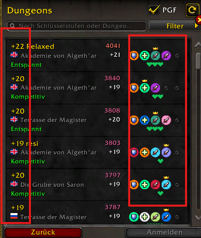
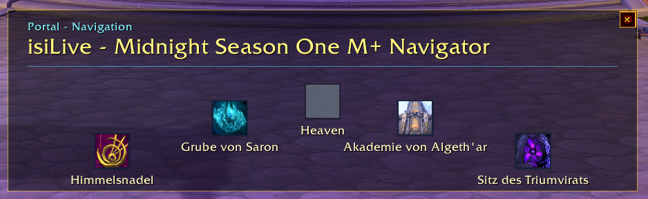
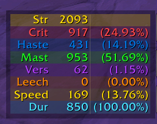

# isiLive

**The colorful Mythic+ command center for World of Warcraft.** isiLive turns group prep, LFG decisions, dungeon portals, enemy forces, cooldowns, death tracking, and key sharing into one compact window.


**Built for:** Mythic+ players, premade groups, and LFG runs

**Active season:** `midnight_s1` with 8 supported dungeons: `WRS`, `MT`, `NPX`, `MC`, `AA`, `POS`, `SOT`, `SR`

**Prepared season:** `midnight_s2` is fully recorded but not live. All eight ChallengeMapIDs, castable portal spell IDs, Mythic+ LFG activity IDs, localized display names, short codes, and the map-ID display order are verified. S2 is armed for automatic selection: it activates itself once Blizzard's challenge-map table matches the recorded S2 map set exactly, so while S1 is live nothing changes. Selection is runtime-only and never rewrites the manifest's `activeSeasonID`, which stays available as the manual fallback. Season 2 does not depend on its optional MDT forces database; until a matching S2 database ships, Blizzard's overall dungeon progress remains visible while MDT-dependent mob percentages and tooltip lines stay hidden.

Season maintenance is driven by one normalized manifest. Portal, LFG activity, display, level-gate, and portal-room indexes are derived from the same per-dungeon records; the generated MDT forces snapshot remains separate, records the exact upstream commit, and is hidden at runtime as soon as its verified expiry date passes.

The current development build introduces a shared cool blue/slate UI system for the main window. Its title chrome, column headers, toolbar controls, action surfaces, hover states, and pressed states now use one semantic component set. Ready Check and Countdown are visually primary actions; Share Keys, Refresh, and Countdown Cancel remain quieter secondary actions. Existing layouts, secure actions, and button sizes are unchanged. Every isiLive-owned window now uses the same quiet slate close control with a compact `×`; its restrained red danger state appears only on hover or press.

The same visual language now groups the dungeon portals, Battle Res/Bloodlust status, M+ timer, and enemy-forces tracker into one coherent run zone. Center notices and the Portal Navigator share a modern card surface and top accent; the navigator also renders the verified localized direction labels and empty-slot detail already supplied by its status model.

The supporting surfaces now complete that hierarchy: the Stats Box restores its established distinct color for every stat, Settings use cool topic cards and a task-oriented order, ESC shortcuts share consistent secondary action states, and LFG flags/hearts occupy less row space. Enemy-forces nameplates, private tooltips, forces tooltip lines, and death alerts use matching compact surface, text, and contrast roles without changing their data or actions.

The main M+ title no longer repeats the `BETA` label, while the Settings beta notice remains. Both blue header separators now share the same 8 px horizontal bounds, and the action, portal, timer, and enemy-forces blocks terminate on one common right edge.

The compact V and H views keep one uninterrupted main background without dark inner cards crowding their actions and world markers. The V/H/M+ selectors use quiet blue/slate title controls with a stronger active state; compact dimensions, button positions, and secure marker actions remain unchanged.

The visible M+ title keeps its integer optical correction, while every 20 px title-bar control — including M+, H, V, utility, lock, settings, and close — now shares the vertically centered `y=-4` anchor in every layout.

Background Opacity once again governs the complete main UI. The title chrome, portal tiles, BR/BL and M+ timer block, and enemy-forces tracker retain only a subtle semantic tint that scales live with the selected opacity instead of stacking an almost opaque dark layer over the main background.

Version `0.9.371` repairs the enemy-forces database, which shipped a second season's dungeons: the upstream source now publishes two seasons in one folder and the generator was not filtering by season, so the previous release carried a 16-dungeon database stamped as Season 1. The generator now filters by season and refuses to write an incomplete database; every Season 1 mob value is unchanged, and automatic Season 2 selection was never affected. Nothing changes on screen. Version `0.9.370` is a maintenance patch from a full code audit; nothing changes on screen. The repair pass that bounds the saved error log could make a damaged log unreadable instead of trimming it, a hearthstone click could freeze the client whenever the owned-toy list held the same entry twice, the status line formatted an unrounded key level where the chat announce rounds it, and a dead handle on a protected raid-marker call was still being captured at startup. The enemy-forces database was refreshed, and the generator behind it was repaired after an upstream source change stopped it loading any dungeon data at all. Version `0.9.369` focuses the addon on the content it is built for: it now resolves exactly three runtime profiles from one place. In a raid or any group larger than five it switches off completely and unregisters its events instead of merely discarding them; in the open world, normal, heroic, timewalking, delves, torghast, and follower dungeons it keeps the group display and group sync but stops the kick sync, the cooldown tracker, and the last-run DPS snapshot; and mythic dungeons — including a key dungeon before the keystone goes in — keep the full feature set. The same release fixes timewalking dungeons being labelled "Mythic" in the status line, and a "you are not in a group" chat error that could appear inside an automatic instance group. Version `0.9.368` is a maintenance patch that closes a blind spot in the build gates: twelve deterministic simulators existed without any pipeline running them, five of which had been failing unnoticed, and a new gate now enforces that every simulator is executed by both CI paths. Nothing changes on screen. Version `0.9.367` is a maintenance patch from a second code audit: the VIP Death Knight helper is now covered by the startup module guards instead of failing silently, peer-supplied version strings are stripped of UI markup before they reach the roster tooltip, and the enemy-forces database was refreshed. Nothing changes on screen. Version `0.9.366` is a maintenance patch from a full code audit: every WoW 12.0 Secret-Value check now runs through one shared guarded helper instead of thirteen private copies, and the build gate protecting it now also guards that helper. Nothing changes on screen. Version `0.9.365` is the fix release for the ESC menu addon shortcuts, which could disappear entirely on WoW 12.0 when the current character name was unavailable. Version `0.9.364` is a maintenance patch from a code audit: the Stats Box short labels and the close-button danger colors moved into the shared locale and color tables, with nothing changing on screen. Version `0.9.363` is the UI-modernization patch that introduces the shared semantic hierarchy across the main window, M+ run surfaces, notices, Stats Box, Settings, ESC shortcuts, compact LFG markers, nameplates, tooltips, and death alerts. Version `0.9.362` separated LFG resolution, bonus evaluation, Blizzard Group Finder view hooks, Portal Navigator notices, and ESC-menu panel rendering into focused modules with deterministic architecture coverage. Automatic Season 2 selection remains unchanged: the switch happens only once Blizzard ships the exact recorded dungeon set.

**Setup:** install, join a 5-player group, and the window opens automatically.

---

## Why isiLive?

### GREEN HEARTS: better LFG decisions

Instantly see useful, non-stacking group buffs in Blizzard LFG search results, applicant rows, and your active roster.


### ONE WINDOW: group, keys, cooldowns, forces, portals

Spec, role, language, key, iLvl, Raider.IO, last-run DPS, interrupt state, leader marker, isiLive peer marker, group-bonus hearts, and ghost rows after leavers.

### LIVE FORCES: pull planning while the key is running

Track enemy forces, pull prediction, nameplate percentages, tooltip percentages, and combat-end refresh from the bundled MDT-synced database.

### PORTAL GRID: current season travel in one place

The matching season portal highlights from verified LFG or listing context, with cooldowns visible at a glance.


### RED ALERTS: deaths and run utility

Tank and healer deaths during active Mythic+ keys trigger a large on-screen warning and bundled WAV audio. Battle Res, Bloodlust, ready sounds, and death counts stay visible where you need them.

---

## Feature highlights

### Group Finder clarity

**GREEN HEARTS** show when an applicant, search-result group, or roster member adds useful class-bonus coverage for your current character. Utility such as Battle Res and Bloodlust can still appear in tooltips, but it does not inflate the heart score.

**LANGUAGE FLAGS** help you scan LFG and roster rows faster. Dynamic isiLive-owned text uses Cyrillic-capable rendering for Russian names and payloads.

**VERIFIED TARGET HINTS** keep portal highlighting and pre-key dungeon labels tied to observed Blizzard LFG context instead of guessed names.

Verified pending Queue-join context also survives unrelated LFG refresh noise until the group join or an explicit Queue lifecycle transition consumes it; after the join, late event text cannot replace the already captured group.

### One-window Mythic+ control

**ROSTER:** spec, role, key, iLvl, Raider.IO, DPS, interrupt status, leader crown, isiLive peer marker, green group-bonus hearts, and right-click whisper.

**ENEMY FORCES:** bottom killtracker, pull prediction, nameplate percentages, mob tooltip percentages, and immediate combat-end refresh.

**PORTALS:** all current season dungeon teleports in one grid with cooldowns, ready states, and target highlight.

**RUN ALERTS:** Battle Res charges, Bloodlust cooldown, ready sounds, BR/Lust group announcements, tank/healer death warning, and tracked per-player death counts.

### Sync without chat spam

isiLive users in the same group automatically exchange useful state through AddOn messages: keys, stats, DPS fallback data, target dungeon, interrupt readiness, cooldown locks, and peer detection. Key sharing posts your key first, then asks other isiLive peers to post theirs through the fastest AddOn-message priority path. Verified dungeon-finder instance groups, such as timewalking runs, use the instance chat channel instead of pretending to be a normal party.

---

## Screenshots

| M+ roster and tools | Group Finder buff hearts |
|---|---|
|  |  |

| Portal navigator | Player stats box |
|---|---|
|  |  |

---

## What it does

When you join a group, isiLive gives you a colorful, compact overview of the things that matter before and during a key:

- Choose better groups and applicants with green class-bonus hearts.
- See every group member's spec, item level, Raider.IO score, key, last-run DPS, role, language, and interrupt status.
- Share keystones between isiLive users without manual copy/paste.
- Jump to the right season portal from one grid with cooldown and target highlighting.
- Track enemy forces through a bottom progress bar, live pull prediction, nameplates, and mob tooltips.
- Watch Battle Res, Bloodlust, M+ timer cutoffs, and death counts without opening extra panels.
- Get clear red tank/healer death alerts during active keys, with separate sound toggles.
- Use optional VIP helpers: a default-off Bloodlust button debuff warning for verified BL class and pet buttons, including ingame-validated Mage Time Warp `80353` and Marksmanship Hunter Harrier's Cry `466904`, plus a separated DK block for Soul Reaper / Putrefy warnings, Riders horse sound mute, and a localized movable missing-ghoul reminder.
- Keep departed players as ghost rows so post-wipe or post-reset context does not vanish immediately.
- Use optional support tools: ESC-menu shortcuts, Hearthstone and Dalaran travel shortcuts, player stats box, nameplate controls, safe position lock, runtime logs, and a responsive demo simulator with local-only preview categories.

Everything syncs automatically between group members who run isiLive. No manual import. No guessed dungeon targets. No `/say` spam.

---

## License

isiLive source code is released under the standard [MIT License](LICENSE).
Third-party libraries and bundled media retain their own documented status; see
[`docs/ASSET_PROVENANCE.md`](docs/ASSET_PROVENANCE.md) for the current provenance record.

## Install

1. Download from **CurseForge** or **Wago**, or drop the folder `isiLive/` into `World of Warcraft/_retail_/Interface/AddOns/`.
2. Start the game. The window opens automatically the next time you join a 5-player group.

No setup required. Open the settings via **Escape → AddOns → isiLive** if you want to change language, sounds, or auto-open behavior.

The optional Escape-menu Addons panel shows shortcuts only for supported addons that are installed and enabled. External shortcuts first close the Game Menu, wait until it is observed closed, then use the target addon's registered slash handler directly after any verified load-on-demand load. They do not write slash text into chat.

---

## Main window

The window opens automatically when you join a group and closes when you leave. You can also open or close it yourself:

- **`Ctrl + F9`** — toggle the window
- **× button** in the top-right corner — close it
- **Lock icon** in the top-right — prevents dragging so the window doesn't move by accident
- Drag the title bar to move the window. The position is remembered, and the window stops at the WoW screen edge instead of being draggable outside the game view.

### Layouts

The window comes in four layouts. Click the button in the title bar to switch:

| Button | Layout | What you get |
|---|---|---|
| **M+** | Compact main | Full roster + all M+ tools stacked (default) |
| **M** | Main | Roster + tools in a classic stacked view |
| **H** | Horizontal | Slim tool strip — just the essentials |
| **V** | Vertical | Small palette with short `RC` / `CD10` / `CD0` leader buttons and two compact marker columns |

The selected layout is remembered across sessions.

---

## The roster

Columns in order: **Spec · Name · Lang · Key · iLvl · RIO · DPS · Kick**

- **Spec** — role-sorted: tanks first, then healers, then DPS. Once a player's inspected specialization is verified, isiLive corrects stale group-role assignments through Blizzard's specialization role API.
- **Lang** — spoken-language flag for the player
- **Key** — keystone and level, short code (e.g. `MT +14`, `DAWN+12`). Red if this player owns the key you joined for.
- **iLvl** — equipped item level
- **RIO** — current Raider.IO score. After a run, a green `(+X)` shows the gain: `(+12)3521`
- **DPS** — overall DPS from the last dungeon, read from Blizzard's in-game damage meter
- **Kick** — green `ready`, red seconds on cooldown, or `-` if the spec has no interrupt. Heal specs without interrupt (Holy Paladin, Mistweaver Monk, Restoration Druid, Discipline / Holy Priest) correctly show `-` instead of a stale cooldown. **Hover** over the cell to see extra interrupts the player has via talents (e.g. Protection Paladin's Avenger's Shield) — synced live across the group through isiLive.

### Markers next to names

- **Blue heart** — this player also runs isiLive
- **Green heart** — this class/spec provides a useful non-stacking buff for your current character
- **Crown** — this player is the group leader
- **Ghost row** (greyed out) — a player who left the group. Kept visible until the group dissolves or you reload, so you can still see who was there after a wipe or dungeon reset.
- **Right-click a row** to whisper that player

### Ready check

During a ready check, the row background changes color: **green** for ready, **red** for declined or no answer, and **yellow** for still waiting. Blizzard's ready, not-ready, and waiting icons repeat the same state without relying on color alone. After the ready check ends, ready/declined colors and icons stay visible for 20 seconds so you can glance at who responded how.

---

## Tools in the main window

### M+ Utility Row

The compactly stacked M+ layout keeps the full five-player roster clear of the leader-action row without increasing the window height. The portal grid sits 3 px above the BR/Lust and M+ timer row. Starting the demo for the first time after a reload keeps this same normal window height while the missing preview rows are created.

- **BR** — Battle Res charges and cooldown with icon, plus optional ready WAV when a charge returns
- **Lust** — Bloodlust/Heroism cooldown with icon and remaining time
- **M+ Timer** — `+3 / +2 / +1` cutoffs counting down live, plus death penalty; resets immediately when the key completes or is aborted

### Killtracker (Enemy Forces)

A bottom bar that shows your kill-count percentage:

- **Green** < 80%, **Yellow** < 95%, **Red** ≥ 95%
- After a verified LFG invite target announce, the bar shows the target dungeon and key level right-aligned until the key starts
- During an active key, the verified dungeon name stays visible on the progress bar as a left-aligned outlined label with the started key level read from the active Mythic+ timer snapshot
- During a pull, a light-blue segment on the right shows **how much the current pull will add** (`+X.XX%`) — so you can see mid-pull whether it's enough
- When combat ends, the tracker refreshes Blizzard's live scenario progress immediately, so the last pull is counted before the next pull or boss engagement

### Teleport Grid

All 8 season dungeon portals in one place:

- **Icon + short code** when ready (e.g. `MT`, `DAWN`)
- **Cooldown timer** when on cooldown, normalized to the current portal cooldown cycle
- **Account-wide unlock memory** from live-confirmed Blizzard spellbook results; after isiLive has observed a portal on one character, alts reuse that verified unlock. Returning dungeons have no level-90 gate, while explicitly marked new Midnight dungeons show the level requirement below 90
- **Highlight** when a portal becomes available
- **Highlight + gold border** on the right portal when you accept an LFG invite or create your own LFG listing for a dungeon

### Markers (for everyone)

Eight world-marker buttons: **Square, Triangle, Diamond, Cross, Star, Circle, Moon, Skull**. Anyone in the group can use them — not just the leader.

### Role icons = one-click marks

Click the **tank icon** in a roster row to put a **blue square** on that player. Click the **healer icon** for a **green triangle**. Works for everyone, not only the leader.

### Group leader buttons

Only enabled when you are the leader:
- **Ready Check**
- **Countdown 10s / Countdown 0s** (pull timers)

### Share Keys

Posts everyone's keystone in group chat — yours first, then other isiLive users reply with their own. Your own post keeps the keystone clickable when Blizzard exposes a real `|Hkeystone:...|h` link or the verified keystone item hyperlink for item `180653`; if no real link exists, isiLive posts plain uncolored text instead of fabricating a chat link. The button has a 30-second cooldown after a real local share or successful peer request and keeps the remaining seconds visible during that lock; receiving clients also lock their button for 30 seconds whenever a valid peer request arrives, even if they have no key to post.

### Re-Sync

Forces a fresh sync round. Use it if someone's iLvl or key looks stuck. Asks compatible LibKeystone addons for their keys too. 10-second cooldown. Hidden in the compact vertical **V** layout.

---

## Mythic+ features

### Forces on mob tooltips

When you hover a mob during a key, the tooltip gains a line:

```
+3 progress (1.25% of 240)
```

That tells you how much that mob is worth and what fraction of the dungeon-total it represents — handy to decide whether a pull gets you over a threshold. Localized in all 8 supported languages (DE: `+3 Fortschritt (1,25% von 240)`).

The percent is computed from the bundled MDT-synced forces DB, **not** from Blizzard's `GetUnitCriteriaProgressValues` API directly. That API in 12.0+ protected contexts can return cumulative dungeon progress instead of the per-mob contribution; reading from the DB is deterministic and immune to that drift.

### Forces overlay on enemy nameplates

Default-on text over every hostile unit's nameplate during a key; Settings -> Nameplates can disable it or hide the remaining-needed suffix.

```
1.16%
```

Configurable: percent toggle, font size 8-24, position around the nameplate (LEFT/RIGHT/TOP/BOTTOM). Same DB-based source as the tooltip — deterministic mob contribution, never the cumulative progress.

The Settings preview uses the same formatter and anchor semantics as the live overlay. With Platynator, isiLive anchors to Platynator's visible health widget when that frame is present; otherwise it falls back to Blizzard-style healthbar anchors.

### Player stats box

An optional standalone stats box can be enabled in Settings. It is independent from the M+, H, and V layouts and can be moved separately.

- Shows the class-appropriate primary stat (`Str`, `Agi`, or `Int`) plus `Crit`, `Haste`, `Mast`, `Vers`, `Leech`, and `Speed` when Blizzard's live APIs provide those values; German uses the compact labels `Beweg`, `Krit`, `Tempo`, `Meist`, `Versa`, and `Haltb` for agility, critical strike, haste, mastery, versatility, and durability
- Uses short English labels only
- Uses the established fixed per-stat color palette for labels, values, percentages, and subtle row tints
- Values and percentages are right-aligned for compact scanning; the value column keeps a stable compact width for larger live stat values, including Stamina rows without a percent value, and the percent column fits values up to `(999.99%)`
- Can be locked, hidden, moved, and configured with separate background opacity and relative font size
- Starts disabled by default

Plater / Platynator users: a soft warning is shown in Settings if either is loaded. isiLive still renders when enabled and does not hard-disable itself; you can turn the overlay off there if you prefer an external addon script to own M+ forces text.

### Battle Res / Bloodlust chat announce

During an active key, every time someone in the group casts a Battle Res or starts Bloodlust, isiLive posts a short line:

```
Alice used BR
Bob started Bloodlust
```

You can turn either announce off in the settings. Non-isiLive group members won't see the message — it's shared only between isiLive users.

### Pre-key group view

When you accept a Mythic+ LFG invite, the matching portal highlights and the center notice includes a clickable portal button from the verified listing activity. The accepted-invite notice shows dungeon, title, leader, and source rows. The dungeon row includes the key level when the level is available from the accepted context or as an exact `+N` in the verified LFG group title. The chat tells you which dungeon and level you joined, and the bottom M+ killtracker mirrors that verified target as a right-aligned dungeon + key-level label until the key starts. Raid LFG accepts stay silent because they are outside the Mythic+ target pipeline.

### Group Finder class-bonus hints

Optional Group Finder hints help you scan applicant and search-result rows for useful class buffs before you join a group or accept someone into your own listing. The goal is to answer one question quickly: **what does this group add for my current character that is actually useful and not already duplicated?**

- **Search result rows** show compact green heart texture markers directly inside the Blizzard row, independent of third-party class-badge addons.
- **Applicant rows** show language flags beside the applicant name and the same heart markers to the right of the class badge when that applicant offers a relevant non-utility group bonus.
- **Roster rows** show the same compact green heart markers directly next to the member name when the verified class/spec offers a relevant non-utility group bonus.
- **Tooltips** add localized bonus text per listed class/spec, so you can see which buffs created the marker score.
- **Relevance is player-aware:** physical, magic, intellect, attack-power, stamina, mastery, versatility, enemy-damage and universal damage bonuses are counted only when they matter for your current character profile.
- **Non-stacking bonuses are deduplicated:** two players with the same class buff count once per search result, so the marker score reflects coverage instead of duplicate noise.
- **Utility stays separate:** Battle Res, Bloodlust, PI, Devotion Aura, Atrophic Poison, Healthstone and similar utility notes may appear in tooltips, but they do not inflate the compact green heart score.
- **Heart scale:** 1 heart means one useful non-stacking buff, 2 hearts means two, 3 hearts means three, and 4 hearts means four or more.
- **Default-on setting:** **Display -> Group Finder: Buff rating hearts**. The settings description shows the same fixed-size green heart texture examples using `media/heart_bonus_green.tga`.

### Ghost rows after wipes / reloads

If the group breaks up or someone disconnects, their data stays visible as a greyed-out row. You can still see what spec/key they had. Joining a new group clears the old ghosts.

---

## Hotkeys

| Key | Action |
|---|---|
| `Ctrl + F9` | Toggle the main window |
| `Ctrl + Alt + F9` | Toggle demo mode with full preview surfaces (for testing without a group) |

Demo mode previews the current surfaces together: roster rows, ghost rows, M+
timer / cooldown / forces data, ready-check hold colors, Share Keys cooldown,
Portal Navigator, center notices, stats box, nameplate / tooltip forces, LFG
bonus hearts, death alert, ready-check sound, and sound preview.

## Slash commands

```
/isilive help         — show normal user commands
/isilive admin        — show administrative / support commands
/isilive settings     — open the settings panel
/isilive lock         — lock window position
/isilive unlock       — unlock window position
/isilive resetui      — recenter window and reset scale + opacity (asks for confirmation)
```

Administrative commands shown by `/isilive admin` include the full preview mode,
runtime / queue / Lua error logs, teleport, season (`/isilive s2d`),
Hearthstone toy, nameplate diagnostics, and binding checks. They are
intentionally kept out of the normal help list. Runtime-log capture starts
disabled each session; retained diagnostics are capped at 800 entries, and
filtered tails search the complete retained buffer.

## Settings

Open via **Escape → AddOns → isiLive**. Everything takes effect immediately.

- **Beta** — current beta notice plus GitHub issue and CurseForge comment links
- **General** — language and default layout when opening isiLive
- **ESC Menu** — ESC shortcut panel toggle, Hearthstone travel shortcut selection, and verified Dalaran Hearthstone travel button
- **Display** — UI scale, background opacity, player stats box controls, minimap button, Portal Navigator, Group Finder language flags and class-bonus hints
- **Behavior** — addon sync, lock main frame position, fade in combat, auto-show/hide triggers (show on login, auto-open on M+ queue, auto-open on key end, auto-close on key start, auto-close on leaving the group), raid behavior status
- **Nameplates** — enable forces overlay, font size, position, percent toggle
- **Sounds** — lead transfer, full group, ready-check complete, incoming summon, Battle Res, Battle Res Ready, Bloodlust, Bloodlust Ready, and tank/healer death alert; all isiLive alerts use bundled sound assets, the selected sound channel, and one-second protection against immediate identical repeats
- **Chat Announcements** — announce Battle Res / announce Bloodlust
- **Administrative** — Advanced Combat Logging, Blizzard Damage Meter reset, queue debug log, runtime log (capture toggles reset on reload while capped support logs remain available), plus dedicated **Clear Queue Debug Log** / **Clear Runtime Log** buttons and reset actions
- **VIP Guest Settings** — mount sound mute toggles for Astral Aurochs, Grand Expedition Yak, and Trader's Gilded Brutosaur, a default-off Bloodlust button debuff warning for verified BL class and pet buttons, then a separated DK block with Soul Reaper / Putrefy warnings, Riders horse sound mute, and a movable localized missing-ghoul reminder

### Languages and translations

- User-facing text is localized through the locale tables.
- New built-in text is maintained in English and German first.
- Other prepared locales may temporarily use English fallback text outside the Settings panel until a translator updates them.
- Settings labels and descriptions are post-edited for the prepared French, Spanish, Portuguese, Italian, Russian, and Turkish locale tables; deterministic coverage prevents unmarked English fallback text in prepared Settings locales.
- Community translation pull requests are welcome; accepted translators are credited in the changelog.

### Auto-open defaults

- Open on joining a group — **on**
- Open when a key ends — **on**
- Close automatically when the key starts — **off** (separate toggle)
- Close automatically when leaving the group — **off** (separate toggle)
- Show on login/reload — **on** (except in raid groups)
- Raid groups hide the window completely and pause all background processing; if the window was open before raid mode, it reopens when the group returns to party size

---

## FAQ

**Why don't I see DPS after a run?**
DPS is read from Blizzard's own damage meter. If Blizzard hasn't finalized the session yet, isiLive briefly retries. If the damage meter has no data for a player (e.g. late joiner), the DPS column stays empty rather than showing a guess.

**Why is the Key column empty for another player?**
They either don't have a keystone, or they don't have isiLive or a LibKeystone-compatible addon to share it.

**Why did my portal highlight disappear?**
You're already inside the dungeon, or the LFG queue was cancelled, or the group dissolved — any of those clears the highlight.

**Why is the main window gone in a raid?**
Raid groups (6+ members) are a hard-off state: UI hidden, background sync off. If the window was open before raid mode hid it, it comes back when the group drops to party size; if you had it closed, it stays closed.

**Why did the chat announce not fire?**
BR/Lust announce only fires during an active M+ key. Also check the Chat Announcements toggles in the settings.

---

## Links

- **Source code:** [github.com/byi77/isilive](https://github.com/byi77/isilive)
- **Bug reports / feature requests:** GitHub issues
- **Technical documentation:** [`docs/`](docs/)
- **Public season-change checklist:** [`docs/SAISON_WECHSEL.md`](docs/SAISON_WECHSEL.md)
- **Bundled asset provenance:** [`docs/ASSET_PROVENANCE.md`](docs/ASSET_PROVENANCE.md)

Also published on CurseForge and Wago — search for *isiLive*.
