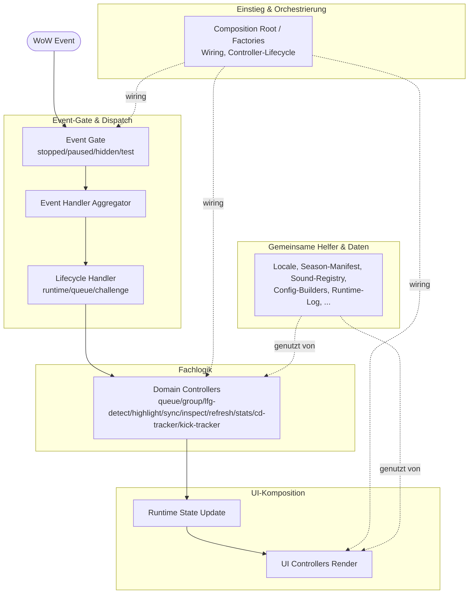

# isiLive Architektur

Versionsbasis: `0.9.371`
Zuletzt aktualisiert: `2026-08-05`

## Zweck

`isiLive` ist ein WoW-Mythic+-Gruppenhelfer.
Ein verifizierter Non-Challenge-Party-Dungeon darf nur einen versteckten Utility-Kontext fuer ausgewaehlte Gruppenfunktionen aktivieren; M+-Timer, M+-Forces, RIO-Delta und Keystone-Level bleiben echte M+-Funktionen.
Interner Runtime-Namespace und Moduldateien bleiben `isiLive_*`.
Die Architektur ist eventgetrieben und in klare Runtime-Schichten aufgeteilt:

1. WoW-Event-Eingang und Gate.
2. Fachlogik fuer Queue, Gruppe, Sync, Highlight und Inspect.
3. UI-Rendering und Benutzeraktionen.

## Schichtueberblick

| Schicht | Verantwortung | Primaere Dateien |
|---|---|---|
| Einstieg und Orchestrierung | Composition-Root-Delegate, Runtime-State, Wiring, Controller-Lifecycle, Modulguards, Minimap-, Demo-, Notice-, LFG-/Teleport-Wiring-, Primary-, Status-, Secondary-, Runtime-Helper-, Status-/Operational-, Testmode-/Binding-, Combat-Announce-, Death-Alert-, Lokalisierungs-, Refresh-, Secondary-Runtime-, CD-Tracker- und Kick-Tracker-Submodul-Factories | `isiLive.lua`, `isiLive_runtime_state.lua`, `isiLive_bootstrap.lua`, `isiLive_runtime_setup.lua`, `isiLive_controller_wiring.lua`, `isiLive_controller_init.lua`, `isiLive_factory.lua`, `isiLive_factory_frame_bridge.lua`, `isiLive_factory_controllers.lua`, `isiLive_factory_primary.lua`, `isiLive_factory_status.lua`, `isiLive_factory_secondary.lua`, `isiLive_factory_lfg_wiring.lua`, `isiLive_factory_runtime_helpers.lua`, `isiLive_factory_status_helpers.lua`, `isiLive_factory_testmode_bindings.lua`, `isiLive_factory_combat_announces.lua`, `isiLive_factory_death_alert.lua`, `isiLive_factory_localization.lua`, `isiLive_factory_refresh.lua`, `isiLive_factory_secondary_runtime.lua`, `isiLive_factory_cd_tracker.lua`, `isiLive_factory_demo.lua`, `isiLive_factory_notices.lua`, `isiLive_factory_minimap.lua`, `isiLive_factory_kick_tracker.lua`, `isiLive_frame_bridge.lua`, `isiLive_context_helpers.lua`, `isiLive_guards.lua` |
| Event-Gate und Dispatch | Stop/Pause/Hidden/Test erzwingen, Lifecycle-Handler routen, Slash-Commands dispatchen | `isiLive_events.lua`, `isiLive_event_handlers.lua`, `isiLive_event_handlers_runtime.lua`, `isiLive_event_handlers_queue.lua`, `isiLive_event_handlers_challenge.lua`, `isiLive_event_utils.lua`, `isiLive_commands.lua` |
| Fachlogik | Queue-Parsing und Join-Flow, LFG-Invite-/Listing-Detektion, Gruppenmodell, Highlight-Aufloesung, Key-Sync, Refresh, Inspect inklusive verifizierter Spezialisierungsrollen-Korrektur fuer das Roster, Leader-Transitions, begrenzte Run-Stats, Cooldown-/Interrupt-Tracking inkl. Multi-Kick-Extras-Tracking pro Klasse (Prot Pala Avenger's Shield, Warlock-Pet-Switching) mit `CLASS_INTERRUPT_LIST`-Whitelist, per-Spec-Kick-Daten, Mythic+-Timer-State, BR-/Bloodlust-Combat-Events mit Self-Cast-Filter und dedupliziertem Group-Announce, VIP-DK-Seelenernter- und Putrefy-Warnungen aus lokalem Dark-Transformation-Cast und verifizierten Actionbar-Spell-IDs inklusive Secure-Actionbutton-Attributen, eine default-aus VIP-Bloodlust-Debuff-Button-Warnung fuer verifizierte Bloodlust-Klassen und verifizierte Erschoepfungs-/Satt-Auren sowie ein verschiebbarer VIP-DK-Ghoul-Reminder ueber Blizzard-State-Driver, Tank-/Heiler-Death-Watch (edge-getriggerte `UNIT_HEALTH`-Toderkennung pro GUID, im aktiven M+-Run oder verifizierten Non-Challenge-PartyRun-Utility-Kontext), M+-Killtracker mit DB-Total-Fallback, API/DB-Drift-Warning, Combat-End-Live-Refresh und aktivem Live-Refresh-Ticker | `isiLive_queue.lua`, `isiLive_lfg_entry_resolver.lua`, `isiLive_lfg_detect.lua`, `isiLive_group.lua`, `isiLive_highlight.lua`, `isiLive_keysync.lua`, `isiLive_refresh.lua`, `isiLive_inspect.lua`, `isiLive_sync.lua`, `isiLive_stats.lua`, `isiLive_cd_tracker.lua`, `isiLive_kick_tracker.lua`, `isiLive_mplus_timer.lua`, `isiLive_leader_watch.lua`, `isiLive_combat_events.lua`, `isiLive_pi_tracker.lua`, `isiLive_action_button_overlay.lua`, `isiLive_bloodlust_button_warning.lua`, `isiLive_vip_dk_assist.lua`, `isiLive_death_watch.lua`, `isiLive_killtrack.lua` |
| UI-Komposition | Main-Frame mit Close-/Lock-/Reset-Controls und Reset-Bestaetigung in eigenem Main-Frame-Split, ununterbrochener Hauptflaeche ohne zusaetzliche innere Karten in den V-/H-Kompaktlayouts bei unveraenderten festen Layoutbudgets, screen-geklemmten frei verschiebbaren Fenstern, zentralem lesbarem Textpfad fuer kyrillische Payloads in addon-eigenen FontStrings und privaten Tooltips, eigenstaendiger Spieler-Stats-Box mit separater Position/Deckkraft/Schriftgroesse/Lock-Option, responsiv an der tatsaechlichen Main-UI angedocktem Demo-Simulator mit aufloesungsabhaengigem Seitenfallback, loesbarem Dock, kategorisierten lokalen Vorschauaktionen und farblich-textuellem Status, Roster-Zeilenmarkup inklusive Buff-Rating-Herzchen direkt am Spielernamen, Roster-Panel mit Chrome-/Render-/Helpers-/CD-Row-/Kill-Row-Splits, Roster-Hover-Tooltip mit Spec/Class/iLvl/Rio/DPS plus Multi-Kick-Extras-Block (lokalisierter "Extra kicks:"-Header + per-Spell-Zeilen via `C_Spell.GetSpellName`), optionale Game-Menu-Tooling-/Travel-/Mounts-/Addons-Panels in eigenem Game-Menu-Split mit separater generischer Paneldarstellung sowie Aktions-, Mount- und Travel-/Hearthstone-Auflösung und konfigurierbarer Ruhestein-Auswahl fuer den Travel-Button, Blizzard-Settings-Canvas mit ausgelagertem Reset-Bestaetigungshelfer, Ruhestein-Optionsresolver, generischen Settings-Control-Widgets, Beta-Hinweis oben, eigenem General-, ESC-Menue-, Display-, Behavior-, Nameplate-, Sound-, Chat-, Administrativ- und abschliessendem VIP-Settings-Abschnitt inklusive Gruppensuche-Sprachflaggen und Gruppensuche-Buff-Rating-Herzchen-Schalter mit Beschreibung, Combat-Utility-Zeile mit kompaktem aktivem Lust-Timer, Teleport-Grid und Debug-Navigator, Mob-Tooltip-Forces-Overlay fuer aktive M+-Runs, Mob-Nameplate-Forces-Overlay (per-Mob-Beitrag in % und optionaler Restbedarf aus KillTrack), Killtracker-Bar mit rechtsbuendigem Pre-Key-Zieltext, Live-Prozentanzeige und aktiver Dungeon-plus-Keylevel-Anzeige aus dem M+-Timer-Snapshot, modernisierte Center-Notice-Karten mit gemeinsamem Notice-Helfer und eigenstaendigem Portal-Navigator-Modul, rahmenloser Tank-/Heiler-Death-Alert (grosser roter Text mit Scale-Punch-Animation und Auto-Fade), Statuszeile, LFG-Flag-Icons sowie LFG-Klassenbonus-Hinweise in Tooltips, Bewerberzeilen, Suchergebniszeilen und Roster-Zeilen mit eigenem Blizzard-View-Hook-Modul, Tooltip-Trace-Chat-Frame, Keybindings | `isiLive_ui.lua`, `isiLive_ui_main_frame.lua`, `isiLive_ui_game_menu.lua`, `isiLive_ui_game_menu_panel.lua`, `isiLive_ui_game_menu_actions.lua`, `isiLive_ui_game_menu_mounts.lua`, `isiLive_ui_game_menu_travel.lua`, `isiLive_settings.lua`, `isiLive_settings_reset.lua`, `isiLive_settings_hearthstone.lua`, `isiLive_settings_controls.lua`, `isiLive_settings_sections.lua`, `isiLive_settings_nameplates.lua`, `isiLive_settings_behavior.lua`, `isiLive_settings_sound.lua`, `isiLive_settings_support.lua`, `isiLive_stats_box.lua`, `isiLive_simulation_tablet.lua`, `isiLive_roster.lua`, `isiLive_roster_panel.lua`, `isiLive_roster_panel_chrome.lua`, `isiLive_roster_panel_render.lua`, `isiLive_roster_panel_helpers.lua`, `isiLive_roster_panel_cd_row.lua`, `isiLive_roster_panel_kill_row.lua`, `isiLive_roster_tooltip.lua`, `isiLive_roster_layout.lua`, `isiLive_teleport_ui.lua`, `isiLive_teleport_debug.lua`, `isiLive_mob_tooltip.lua`, `isiLive_mob_nameplate.lua`, `isiLive_notice_common.lua`, `isiLive_portal_navigator_notice.lua`, `isiLive_notice.lua`, `isiLive_death_alert.lua`, `isiLive_status.lua`, `isiLive_lfg_bonus_model.lua`, `isiLive_lfg_view_hooks.lua`, `isiLive_lfg_flags.lua`, `isiLive_trace_chat_frame.lua`, `isiLive_bindings.lua` |
| Gemeinsame Helfer und Daten | Locale, lokalisierte Texte, Units, Realm-Sprachdaten, normalisiertes Season-Manifest als einzige manuell gepflegte Runtime-Saisonquelle, daraus erzeugte Season-Indizes, separat generierter M+-Forces-Datensatz (`data/isiLive_mplus_forces.lua`) mit `expiresAt`-Lifetime-Stempel, sichere Spell-Cooldown-Wrapper, Runtime-Logging, fokussierte Config-Builder, private Tooltip-/UI-Helfer, zentrale Backdrop-Presets, gemeinsamer Actionbar-Kreuz-Overlay-Helfer, gemeinsame Validierungs-/String-Helfer, zentraler Sound-Registry-/Playback-Helfer inklusive Battle-Res-ready-, Bloodlust-ready- und Tank-/Heiler-died-WAV-Assets, deaktivierter nativer WoW-Text-to-Speech-Ausgabe und verifizierter VIP-Mount-Sound-Datei-IDs fuer Mute/Unmute, Debug-Helfer, Demo-/Test-Helfer | `isiLive_validation_helpers.lua`, `isiLive_string_utils.lua`, `isiLive_spell_utils.lua`, `isiLive_locale.lua`, `isiLive_texts.lua` (Aggregator) mit `isiLive_texts_common.lua` und den Pro-Sprache-Tabellen `isiLive_texts_<tag>.lua`, `realm_language_data.lua`, `isiLive_units.lua`, `data/isiLive_seasons.lua`, `isiLive_season_data.lua`, `isiLive_mplus_forces.lua`, `isiLive_teleport.lua`, `isiLive_ui_common.lua`, `isiLive_action_button_overlay.lua`, `isiLive_runtime_log.lua`, `isiLive_log_buffer.lua`, `isiLive_config_builders.lua`, `isiLive_queue_debug.lua`, `isiLive_demo.lua`, `isiLive_test_mode.lua` |
| Gebuendelte Assets und Designhilfen | Runtime-Medien bleiben in `media/` und `sounds/`; bekannte und unbekannte Herkunft wird ohne Guessing in `docs/ASSET_PROVENANCE.md` gepflegt. Oeffentliche visuelle Entwicklungs-Mockups liegen unter `tools/mockups/`, dokumentieren ihre Abhaengigkeiten lokal und bleiben ausserhalb des Addonpakets. | `media/`, `sounds/`, `docs/ASSET_PROVENANCE.md`, `tools/mockups/README.md` |
| Vendored Libraries | Shared Addon-Message-Throttling ueber ChatThrottleLib v24 mit Prioritaets-Routing (`ALERT` / `NORMAL` / `BULK`) pro Nachrichtentyp; Fallback auf raw `C_ChatInfo.SendAddonMessage`, wenn die Lib nicht geladen ist | `libs/ChatThrottleLib/ChatThrottleLib.lua` |

Der 500 px breite M+-Modus besitzt einen expliziten Darstellungsvertrag: Beide
blauen Header-Trenner liegen links und rechts jeweils 8 px innerhalb des
Main-Frames. Aktionszeile, Portalreihe, BR-/BL- und M+-Timer sowie Killtracker
enden gemeinsam bei x=494. Der Titel rendert keinen `BETA`-Zusatz; der
Beta-Hinweis in Settings bleibt davon unberuehrt. Die Stats Box verwendet fuer
Labels, Werte, Prozente und dezente Zeilentints ihre feste, je Stat
unterschiedliche Farbpalette; die live Blizzard API bleibt alleinige Quelle
der angezeigten Werte.

`UICommon` registriert Titelflaechen und semantische M+-Run-Flaechen als
deckkraftgekoppelte Strukturtints. Ihre effektive Alpha ist deterministisch
`Background Opacity * 0,24`; dadurch bleiben Farbgruppe und Border sichtbar,
ohne ueber dem bereits transparenten Main-Backdrop eine fast deckende zweite
Hintergrundschicht zu bilden. Registrierung malt den gespeicherten Startwert,
`ApplyBgAlpha` aktualisiert alle noch lebenden registrierten Flaechen sofort.

Alle addon-eigenen Fenster mit sichtbarem Schliessen-Control beziehen dieses
ueber `UICommon.CreateCloseButton`: Main-Frame, Center-Notice,
Portal-Navigator und Demo-Simulator verwenden dasselbe kompakte `×`, dieselbe
ruhige blau/slate Defaultflaeche und denselben erst bei Hover beziehungsweise
Press sichtbaren roten Gefahrzustand. `CreateRedCloseButton` bleibt nur als
Kompatibilitaetsalias bestehen; Blizzard-eigene Fenster werden nicht umgestylt.

## Runtime-Flow

```text
WoW Event
  -> Event Gate (stopped/paused/hidden/test checks)
  -> Event Handler Aggregator
  -> Lifecycle Handler (runtime/queue/challenge)
  -> Domain Controllers (queue/group/lfg-detect/highlight/sync/inspect/refresh/stats/cd-tracker/kick-tracker)
  -> Runtime State Update
  -> UI Controllers Render
```

Dieselbe Kette als Diagramm, gruppiert nach den fuenf Schichten aus der
Schichtuebersicht oben. Absichtlich grob (Schichten, nicht Dateien) —
Detailtiefe bleibt in der Tabelle, das Diagramm ist reine Navigationshilfe
fuer den Wiedereinstieg nach einer Pause.



## Zentrale Runtime-Zustaende

| Zustand | Verhalten |
|---|---|
| Running | Volle Verarbeitung aktiv |
| Paused | Verarbeitung blockiert ausser fuer erforderliche Uebergaenge |
| Stopped | Addon-Verarbeitung deaktiviert ausser fuer minimale Kontrollpfade |
| Hidden | Fenster ist verborgen, Queue-Scanning ist ausgesetzt; Background-Addon-Sync und Roster-Updates laufen weiter und duerfen UI-State eventgetrieben vor-rendern, ohne zu pollen; eventgetriebene CD-Refreshes fuer Bloodlust-ready- und Battle-Res-ready-Klanghinweise bleiben erlaubt, der permanente CD-Ticker aber nicht; das dedizierte Kick-Keep-Alive bleibt nur fuer verifizierte normale Gruppen oder automatische Instanzgruppen aktiv, waehrend Solo-Zustaende keinen Kick-Scan oder Kick-Sync pollend ausloesen; hidden `LFG_LIST_*`-Luecken werden spaeter nicht als Queue-Chat nachgereicht. Raid-Gruppen sind ein eigener Hard-off-Zustand, der die UI ausblendet und selbst diesen Background-Sync aussetzt, statt dem Hidden-Keep-Alive-Verhalten zu folgen; eine vor Raid-Hard-off sichtbare Main-UI wird beim Rueckweg aus dem Raid wiederhergestellt. |
| Test/TestAll | Einheitlicher Dummy-Vollpreview-Modus fuer UI und Tests, inklusive positivem RIO-Delta-Preview, Ghost-/Leaver-Zeile und responsiv angedocktem, kategorisiertem Demo-Simulator mit ereignisgetriebenem Reflow nach Main-UI- und Sichtbereichsaenderungen |

`RuntimeState.trackedPartyRun` ist kein M+-Timer-Ersatz. Der Zustand speichert nur eine verifizierte positive `mapID`, eine verifizierte positive Difficulty-ID und optional den beobachteten Instanznamen fuer Non-Challenge-Party-Dungeons. Er oeffnet nur Utility-Pfade fuer BR-/Bloodlust-Anzeige, Combat-Announces, DeathWatch und Non-Challenge-DPS-Snapshots und wird bei Challenge-Start, Party-Instanz-Exit, Raid-Hard-off oder unvollstaendigen Live-Daten geloescht. Automatische Dungeonfinder-Gruppen werden fuer die BR-/Bloodlust-Anzeige ueber die verifizierte Instanzgruppen-Kategorie `IsInGroup(LE_PARTY_CATEGORY_INSTANCE)` akzeptiert; ohne normale Gruppe und ohne Instanzgruppe bleibt die Anzeige geschlossen.

## SavedVariables Schema

`IsiLiveDB` ist die einzige `## SavedVariables`-Tabelle des Addons (account-wide). Alle persistierten Settings durchlaufen einen zentralen Schema-Sanitizer, der bei `ADDON_LOADED` einmal laeuft und die Tabelle in einen sicheren Zustand bringt, bevor irgendein Live-Modul daraus liest.

**Sanitizer-Modul:** [core/isiLive_db_schema.lua](../core/isiLive_db_schema.lua)

**Hook-Punkt:** [logic/isiLive_event_handlers_runtime.lua](../logic/isiLive_event_handlers_runtime.lua) `HandleAddonLoadedEvent`, direkt nach `IsiLiveDB = IsiLiveDB or {}`.

**Was der Sanitizer leistet:**
- Fehlende Felder mit deklarierten Defaults befuellen (Pattern-A/B/C aus `CLAUDE.md` weiterhin gueltig).
- Wrong-type-Felder (z.B. `uiScale = "abc"`) auf den Default zuruecksetzen.
- Numeric-Range-Verletzungen auf `min`/`max` clampen (`uiScale` 0.5-2.0, `bgAlpha` 0.0-1.0, etc.).
- Invalide Enum-Strings (`mobNameplatePosition = "MIDDLE"`) auf den Default zuruecksetzen.
- Nested Tables (z.B. `position.point/relativePoint/x/y`) rekursiv validieren — schliesst die v0.9.208-Crash-Klasse, in der eine partiell-kaputte `position`-Tabelle (Sub-Feld nil) `mainFrame:SetPoint(nil, ...)` ausloeste.
- Unbekannte Felder werden NICHT geloescht, damit zukuenftige Migrationen sie nicht verlieren.
- Jede Korrektur wird via `ctx.logRuntimeTrace("[DBSCHEMA] ...")` protokolliert.
- Die Stats-Box-Felder (`statsBoxEnabled`, `statsBoxLocked`, `statsBoxBgAlpha`,
  `statsBoxFontSizeOffset`, `statsBoxDisplayMode`,
  `statsBoxShowLeech`, `statsBoxShowSpeed`, `statsBoxShowDurability`,
  `statsBoxShowStamina`, `statsBoxShowAvoidance`, `statsBoxPosition`) sind
  normale Schemafelder mit Defaults und Range-/Positionsvalidierung; die
  Box-Position bleibt getrennt von der Main-UI-Position.
- Die LFG-Anzeigefelder `lfgFlagsEnabled`, `lfgGroupBonusesEnabled` und
  `tooltipFlagsEnabled` sind Schemafelder mit Default `true`. Der Factory-Load
  spiegelt sie unmittelbar in `LFGFlags.SetEnabled`,
  `LFGFlags.SetGroupBonusesEnabled` und den Roster-Tooltip-Flag-Gate, damit
  Settings-UI, SavedVariables und Live-Hooks nach Reload denselben Zustand
  nutzen.

**Versionierte Migrationen:** `db.__schemaVersion` stempelt die zuletzt angewendete Schema-Version. `MIGRATIONS[N]` haelt Step-Funktionen fuer Uebergaenge alter -> neuer Form (Renames, Removals, Type-Changes). Beim Bump von z.B. v0.9.222 auf v0.9.223 fuegt man:

```lua
local LATEST_SCHEMA_VERSION = 2
local MIGRATIONS = {
  [2] = function(db, log)
    if db.oldFieldName ~= nil then
      db.newFieldName = db.oldFieldName
      db.oldFieldName = nil
      log("migrated oldFieldName -> newFieldName")
    end
  end,
}
```

Jeder Step laeuft genau einmal pro User; `db.__schemaVersion` wird nach erfolgreicher Anwendung auf `LATEST_SCHEMA_VERSION` gesetzt. Bestehende User behalten ihre Settings, neue Felder kriegen Defaults, geaenderte Felder werden migriert.

**Tests:** [testmodul/isilive_test_scenarios_db_schema.lua](../testmodul/isilive_test_scenarios_db_schema.lua) (~27 Szenarien): empty-db-defaults, type-error-repair, range-clamping, enum-validation, nested-table-recursion, partially-broken-position, user-set-preserve, unknown-field-preserve, isolated-default-references, schema-version-stamping, legacy-auto-close-migration, idempotenz.

## Always-on Lua-Error-Erfassung + Size-Guard

`IsiLiveDB.errorLog` ist ein bounded Ring-Buffer (~100 Einträge), der Lua-Errors aus dem isiLive-Code automatisch persistiert — unabhaengig von `runtimeLogEnabled` (debug-mode). Sichtbar in-game ueber `/isilive errorlog [N|status|clear]`.

**Modul:** [core/isiLive_error_log.lua](../core/isiLive_error_log.lua)

**Hook-Punkt:** [logic/isiLive_event_handlers_runtime.lua](../logic/isiLive_event_handlers_runtime.lua) `HandleAddonLoadedEvent`, direkt nach dem DB-Schema-Sanitizer.

**Designprinzipien:**
- **Always-on, nicht debug-gated.** Errors sind selten und wertvoll; `runtimeLog` ist hochfrequent und opt-in, der Error-Buffer ist niederfrequent und immer aktiv.
- **Chain-of-responsibility.** `geterrorhandler() -> previous` wird IMMER zuerst aufgerufen, bevor wir capturen. BugSack / `!BugGrabber` / Blizzards `BasicScriptErrors` bleiben uneingeschraenkt aktiv; wir steigen nur als zusaetzlicher Subscriber ein.
- **Filter auf isiLive-Code.** Nur Errors, deren Message oder Stack `isiLive` mention, landen im Buffer. Plater / WeakAuras / Blizzard-UI-Errors werden bewusst ignoriert. Der Stack-Anteil wird ueber einen `debug.getinfo`-Frame-Probe geprueft, **nicht** ueber einen String-Match auf `debug.traceback`: waehrend `Capture()` liegen immer eigene `isiLive_error_log.lua`-Frames auf dem Stack, ein Traceback-Match waere also unkonditioniert wahr und der Filter wirkungslos. Der Probe schliesst die eigenen Frames per Chunk-Identitaet aus, bricht beim ersten Treffer ab und ist auf `MAX_STACK_PROBE_LEVELS` begrenzt. Er ist ausserdem genauer als der Traceback-Match, weil Lua bei tiefen Stacks mittlere Frames elidiert.
- **Filter vor Traceback.** `Install()` leitet die Errors *aller* Addons durch `Capture()`. Die Reject-Entscheidung faellt deshalb vor `debug.traceback`; der teure Traceback wird nur noch fuer Errors gebaut, die tatsaechlich gespeichert werden.
- **Cross-Session-Zeitstempel.** `firstSeen` / `lastSeen` nutzen `time()` (Unix-Epoche), nicht `GetTime()`. Die Werte sind persistiert und gleichzeitig der Eviction-Schluessel von `TrimToCap`; ein session-relativer Stempel wuerde nach `/reload` frische Eintraege unter die uebernommenen sortieren und zuerst verwerfen. `GetTime()` bleibt reiner Fallback, der Rueckgabewert ist immer numerisch. Alt-Eintraege mit `GetTime()`-Epoche sortieren unter alle neuen und werden zuerst verdraengt — keine Migration noetig.
- **Dedup via count++.** Identischer Error (gleicher `fullText` mit Stack) inkrementiert `entry.count` und `lastSeen`, statt 200 Duplikate zu speichern. Ein Error-Storm in einem Combat-Tick belegt einen Slot statt das Buffer zu fluten.
- **Defensive Capture.** Jeder interner Schritt ist `pcall`-wrapped — ein Error im Error-Logger selbst loest keinen Sekundaer-Cascade aus.

**Size-Guard (Schema-Sanitizer-Integration):** Schema-Felder mit `maxMapEntries`-Property werden vom Sanitizer beschnitten, sobald die Eintraege-Zahl den Cap uebersteigt. Schuetzt vor unbeschraenktem Wachstum bei map-typed Tabellen:

| Feld | Cap | Begruendung |
|---|---|---|
| `errorLog` | 200 | ErrorLog-Modul cappt selbst auf 100; Schema ist Sicherheitsnetz |
| `rioBaseline` | 5000 | unique cross-realm players ueber Lebenszeit (~jahrelang) |
| `stats.playerLastRunByCharacter` | 5000 | per-character Run-Stats |
| `runtimeLog` | 800 (in LogBuffer) | Debug-Trace, ring-buffer enforced |
| `queueDebugLog` | 400 (in LogBuffer) | Queue-Debug-Trace, ring-buffer enforced |

**Trim-Verhalten:** Bei Cap-Ueberschreitung droppt der Sanitizer first-fit-Eintraege via `pairs()`-Iteration (Eviction-Reihenfolge ist absichtlich willkuerlich — Ziel ist Size-Bound, keine spezifische Retention-Policy). Jede Trim-Aktion wird via `[DBSCHEMA] trimmed ...` geloggt.

**Slash-Command:** `/isilive errorlog` zeigt Status (Installed/Count/Cap), `/isilive errorlog 20` zeigt die letzten 20, `/isilive errorlog clear` leert.

**Tests:** [testmodul/isilive_test_scenarios_error_log.lua](../testmodul/isilive_test_scenarios_error_log.lua) (~29 Szenarien): isiLive-Filter, Stack-Frame-Detection, Dedup, Cap-Enforcement, Chain-of-responsibility, Idempotenz, GetTail/Clear-API, Schema-integrierter Map-Trim fuer alle vier capped fields, Frame-Probe-Verhalten (Fremd-Frame abgelehnt, isiLive-Frame akzeptiert, eigene Error-Log-Frames ausgeschlossen) sowie `time()`-Epoche, numerische Stempel-Garantie und Eviction-Reihenfolge gegen Alt-Eintraege.

Die Frame-Probe-Szenarien fahren ihren Aufrufer ueber `load(..., "@<pfad>")` auf einer eigenen Coroutine, weil `debug.getinfo` nur den aktuellen Coroutine-Stack laeuft — sonst laege die Szenariodatei selbst (`isilive_test_scenarios_error_log.lua`) im Stack und jede Probe-Assertion waere trivial wahr. Der `debug.getinfo`-fehlt-Guard hat bewusst kein Szenario: luacov loest das globale `debug` zur Laufzeit auf, ein Stub bricht den instrumentierten Coverage-Lauf. Der Guard faellt fail-closed.

## Deterministischer Regelsatz

1. Dungeon-Ziele werden nur ueber konkrete `activityID -> mapID -> spellID`-Daten aufgeloest.
2. Wenn `mapID`-Kontext fehlt oder mehrdeutig ist, bleibt das Ziel unresolved; es gibt kein Name-/Token-Guessing.
3. Leader-only-Aktionen bleiben explizit und fuer Unbefugte deaktiviert.
4. Combat-sichere UI-Updates werden verschoben, wenn geschuetzte Operationen blockiert sind; Teleport-Action-Buttons duerfen Parent-Frames nicht auf protected promoten, blockierte Main-Frame-Visibility-/Height-Aenderungen sowie blockierte `Esc`-Shortcut-Secure-Button-Refreshes muessen auf `PLAYER_REGEN_ENABLED` wiederholt werden, und die gemounteten `Esc`-Strips bleiben waehrend Combat read-only statt Host-Frame-Re-Shows zu planen.
5. Strata und Level der Teleport-Grid-Buttons bleiben mit Strata und Level des Main-Frames synchron.
6. Bei Shared-Portcast-Spells hat exaktes Activity-Map-Matching Vorrang vor spell-only-Suppression.
7. Highlight-State wird nicht aus mehrdeutigen Shared-Spell-Mappings geloescht, solange exakter Map-Kontext fehlt.
8. Queue-basiertes Target wird bei negativen Application-Follow-up-Events nicht geloescht, wenn bereits eine Gruppe besteht.
9. Blizzard-CVar-State fuer `advancedCombatLogging` und `damageMeterResetOnNewInstance` wird im Blizzard-Settings-Canvas nur gespiegelt und nur auf explizite User-Toggles geschrieben; der Blizzard-Damage-Meter-Reset auf Challenge-Start bleibt aktiv, wenn API-Support vorhanden ist.
10. Pro Spieler wird auf Challenge-Start ein RIO-Baseline-Snapshot erfasst; Delta-Rendering wird erst nach erfolgreichem delayed Post-Run-Refresh aktiviert und bleibt immer nicht-negativ mit Praefix `(+X)`.
11. Completed-Run-Stats muessen verzoegerte Blizzard-Damage-Meter-Verfuegbarkeit ueber kurze deterministische Retries tolerieren, sowohl fuer `M+` als auch fuer verfolgte Non-Challenge-Party-Exits (`Normal`, `Heroic`, `Mythic`); gespeist wird nur die `DPS`-Roster-Spalte.
12. Post-Run-Refresh- und Delta-Pipeline bleibt aktiv, wenn Challenge-Completion-/Reset-Events eintreffen, waehrend das Main-Window hidden ist; der delayed Post-Run-Refresh wird jedoch waehrend Raid-Hard-off verschoben und erst nach erkanntem Raid-Ende fortgesetzt.
13. Der Sync-Handshake bleibt robust: `HELLO`-Empfaenger bestaetigen mit `ACK`, antworten sofort mit dem vollstaendigen lokalen Snapshot `KEY/STATS/DPS/LOC` plus aktuellem Kick-State, explizite lokale Refreshes force-senden das lokale `HELLO` plus `KEY/STATS/DPS/LOC`, und manuelle `REQSYNC`-Refresh-Requests triggern genau eine hidden Reply fuer alle Buckets (`KEY`, `STATS`, `DPS`, `LOC`, `TARGET`, `KICK`), solange der Client nicht stopped oder paused ist. Derselbe Refresh-Pfad sendet zusaetzlich genau eine `LibKS`-Party-Anfrage fuer kompatible Nicht-`isiLive`-Peers. Eingehende `LibKS`-Requests duerfen genau eine Party-Antwort mit lokalem `level,mapID,rio` ausloesen; eingehende `LibKS`-Payloads duerfen nur `Key` und `RIO` aktualisieren und bereits reichere `isiLive`-`Spec/iLvl`-Daten nicht degradieren. `DPS` ist in Background-Snapshots immer enthalten, unabhaengig von der Frame-Sichtbarkeit, damit Peers aktuelle Run-Stats auch hidden erhalten.
14. Im Hidden-Modus sind Queue-Scanning und permanentes Polling ausgesetzt, mit Ausnahme des dedizierten Kick-Keep-Alive fuer verifizierte normale Gruppen oder automatische Instanzgruppen; Solo-Zustaende duerfen keinen Kick-Scan oder Kick-Sync pollend ausloesen. Background-Roster-/Addon-Message-Sync, erforderliche Auto-Open-Transitions, eventgetriebene Pre-Render-Updates, eventgetriebene CD-Refreshes fuer Bloodlust-ready- und Battle-Res-ready-Klanghinweise und genau eine erzwungene Refresh-Reply ohne Unhide bleiben aktiv. Frische Gruppenjoins duerfen zwar auto-open ausloesen, duerfen aber ohne vorherige sichtbare Queue-Capture keine Queue-Chat-Zusammenfassung nachliefern. Nach einem UI-Reload waehrend man bereits gruppiert ist, muss `PLAYER_ENTERING_WORLD` einen vollstaendigen Group-Roster-Rebuild triggern, damit das Roster-Panel sofort wieder erscheint, selbst in Party-Instanzen, in denen das Hidden-Frame-Gate sonst `GROUP_ROSTER_UPDATE` blockieren wuerde; wenn der Reload-Roster-Mirror exakt zur aktuellen Gruppensignatur passt, gilt dieser Restore nicht als frischer Gruppenbeitritt und darf keine Queue-/Join-Notice-Sideeffects ausloesen. Beim erneuten Oeffnen der UI wird ausserdem der Utility-Tracker als dirty markiert, damit der erste sichtbare Render genau einen frischen Utility-Rescan vor dem Zeichnen ausfuehrt.
15. UI-Aktion-Spam-Guards fuer `Re-Sync` und `Share Keys` bleiben aktiv; der manuelle Re-Sync-Button verwendet sichtbar 10 Sekunden Cooldown, ist aber im kompakten vertikalen `V`-Layout verborgen, `Share Keys` 30 Sekunden. Wenn ein `SHAREKEYS`-Sync von irgendeinem isiLive-Peer eingeht, wird der lokale `Share Keys`-Button auf allen empfangenden Clients ueber `TriggerRemoteCooldown` fuer 30 Sekunden gesperrt; ein bereits laufender lokaler Cooldown wird dadurch nicht zurueckgesetzt.
16. Event-Gate-Dispatch bleibt robust: Fehler in Runtime-Handlern muessen gemeldet werden und duerfen den Gate-Loop nicht brechen.
17. LuaLS-Kompatibilitaet in gemeinsamen Helfern bleibt erhalten: `_G.debug` wird geschuetzt abgefragt, und wo Blizzard-Tooltip-APIs noch verwendet werden, kommen explizite Color-Signatures zum Einsatz.
18. Gemeinsame `isiLive`-Tooltip-Frames besitzen ihr eigenes Textlayout und duerfen UI-Hover-Rendering nicht zurueck ueber den geteilten Blizzard-`GameTooltip` leiten.
19. Raid-Gruppen blenden das sichtbare Roster-Panel aus, suspendieren Background-Sync und unterdruecken Raid-Transition- und Raid-LFG-Accept-Notices, indem das Addon bis zum Verlassen der Raid-Groesse in einem Hard-off-Zustand bleibt; nur eine vor Raid-Hard-off sichtbare Main-UI wird danach wieder geoeffnet.
20. Der optionale Game-Menu-Tooling-Strip schliesst das Menu, bevor sein Zielpanel geoeffnet wird; `ReloadUI` gehoert einem Secure-Macro-Button (`/click GameMenuButtonContinue` + `/reload`), der `ActionButtonUseKeyDown` spiegelt und blockierte Secure-Refreshes auf `PLAYER_REGEN_ENABLED` verschiebt, waehrend die anderen Eintraege direkte Opener-Pfade fuer `Professions`, `Talents`, `Spells`, `Achievements`, `Quests`, `Dungeons`, `Journal`, `Collections` und `Guild` behalten. Die Tooling-, Travel-, Mounts- und Addons-Strips sind direkt als `GameMenuFrame`-Kinder gemountet, sodass Combat-Open-Pfade keine Overlay-`Show`/`Hide`- oder Layout-Mutationen ausfuehren; der Travel-Strip bleibt weiter links und bietet `Arkantine`, `Hearthstone`, `Dalaran` und `Housing`, wobei der Dalaran-Button nur bei verifiziert besessenem Dalaranruhestein-Toy `140192` sichtbar ist, der Mounts-Strip sitzt darunter und bietet verifizierte Secure-Macro-Shortcuts fuer Favorit, Auktionshaus-Mount und Reparatur-Mount, wobei Favorit einen konkret favorisierten Mount-Spell aus `C_MountJournal` nutzt. Der Addons-Strip zeigt nur installierte und auf dem aktuellen Charakter aktivierte Schnellzugriffe fuer haeufig genutzte Addons, laedt externe Load-on-Demand-Ziele vor dem Klick verifiziert nach, wartet vor dem Slash-Dispatch auf ein beobachtet geschlossenes `GameMenuFrame`, toleriert eine kurze verzoegerte Registrierung desselben exakten Slash-Alias und ruft danach direkt den registrierten `SlashCmdList`-Handler mit der Blizzard-kompatiblen Argumentform `msg, editBox` auf; der isiLive-Einstieg oeffnet direkt die isiLive-Settings.
21. Voruebergehend versteckte Legacy-Settings-Controls bleiben aus den Blizzard Settings entfernt, waehrend die Runtime ihre festen Defaults (`DPS` an, Markers leader-only aus, feste Namenstrunkierung, Legacy-`Travel`-Grid mit 2 Spalten) erzwingt, bis die Controls wieder freigeschaltet werden.
22. Die Lust-Onset- und Ready-Erkennung des CdTrackers kombiniert Spieler-Harmful-Aura-Scans mit direkten lokalen Lust-Spellcasts, akzeptiert fuer den Lookup nur numerische Aura-`spellId`-Werte, ignoriert geschuetzte oder andere nicht-numerische Werte sicher, behandelt `UNIT_AURA(..., { isFullUpdate = true })`-Restores nach Zone/Reload als nicht-onsetartige Hydration, scannt UNIT_AURA-Removal-Payloads fuer natuerliches Sated-Auslaufen und verwendet nur ein kurzes `PLAYER_ENTERING_WORLD`-Suppress-Fenster von 2 Sekunden als Sicherheitsnetz, bis der vollstaendige Aura-Restore eingetroffen ist.
23. Leader-Gain/Loss-Erkennung vergleicht den aktuellen lokalen Leader-State mit dem gecachten State sowohl auf `GROUP_ROSTER_UPDATE` als auch auf `PARTY_LEADER_CHANGED`; hidden Promotions unterdruecken Center-Notice und Chat-Output, spielen aber weiterhin den Transfer-Sound.
24. Ready-Check-Lifecycle-Events muessen ueber einen dedizierten Roster-Refresh-Pfad laufen, der row-background-State, die farbunabhaengigen Blizzard-Symbole fuer `ready`, `notready` und `waiting` sowie den 20-Sekunden-Hold fuer `ready` und fuer explizit/unbeantwortet `notready` erneut anlegt, ohne den generischen Vollrender des Rosters erneut auszufuehren oder Secure-Role-Button-Attribute anzufassen.
25. Roster-Leader-Marker werden ausschliesslich aus dem gespiegelten `UnitIsGroupLeader`-State abgeleitet; das Roster rendert fuer diese Zeilen eine 16x16-Krone, und bei gesyncten Leadern bleibt die blaue Heart-Markierung vor der Krone.
26. Persistierte Ghost-Zeilen duerfen in nicht-vollen Gruppen bestehen bleiben, aber die Roster-Sortierung muss immer alle aktiven Mitglieder vor Ghosts halten, damit das sichtbare 5-Zeilen-Clipping nie ein aktuelles Gruppenmitglied hinter stale Leavern versteckt.
27. Die optionale Spieler-Stats-Box zeigt nur direkt aus Blizzard-Live-APIs gelesene Werte; Secret Values duerfen nur direkt formatiert werden, fehlende Primary-/Secondary-Werte bleiben unsichtbar statt durch Defaults ersetzt zu werden, Leech, Speed, Haltbarkeit, Ausdauer und Vermeidung sind einzeln schaltbar, und die stabilen Werte-/Prozent-Spalten verhindern abgeschnittene groessere Werte, zeilenweise Verschiebung oder Umbruch bis `(999.99%)`.
28. Frei verschiebbare isiLive-Fenster (Main-UI, Stats-Box, Center-Notice, Portal-Navigator, Demo-Simulations-Tablet) sind an den WoW-Sichtbereich geklemmt; der Minimap-Button bleibt auf seine Minimap-Kreis-Draglogik beschraenkt.
29. Die Ruhestein-Auswahl speichert `hearthstoneChoice` als Schemafeld, aktualisiert die Settings-Liste bei `TOYS_UPDATED` und `GET_ITEM_INFO_RECEIVED`, zeigt im deutschen Addon-Locale client-lokalisierte Namen und in allen anderen Addon-Sprachen die verifizierten englischen Namen. Der Travel-Button nutzt nur Default-Item, random owned oder konkret besessene Toy-IDs; Secure-Attribut-Updates werden im Combat oder waehrend aktivem Keydown verschoben.
30. VIP-Mount-Sound-Schalter persistieren als `vipAstralAurochsSoundMuted`, `vipGrandExpeditionYakSoundMuted` und `vipGildedBrutosaurSoundMuted`; `isiLive_sound_utils.lua` ist Owner der Datei-ID-Sets und wendet `MuteSoundFile`/`UnmuteSoundFile` beim Laden sowie bei Settings-Aenderungen an. Die VIP-DK-Seelenernter- und Putrefy-Warnungen persistieren als `vipDkSoulReaperWarningEnabled` und `vipDkPutrefyWarningEnabled`, sind standardmaessig aus, bleiben in den Settings auch fuer Nicht-DKs sichtbar und werden ueber `isiLive_vip_dk_assist.lua` verarbeitet. Ihr 30-Sekunden-Warntimer nach Dark Transformation wird durch `PLAYER_REGEN_ENABLED` nicht abgebrochen; Regen darf nur sichtbare Overlays schliessen und Ghoul-Deferreds anwenden. Die VIP-Bloodlust-Debuff-Button-Warnung persistiert als `vipBloodlustDebuffButtonWarningEnabled`, ist standardmaessig aus, bleibt in den Settings fuer alle Klassen sichtbar, steht als normale nicht eingerueckte Option direkt unter dem Gilded-Brutosaur-Mute vor der duennen blauen DK-Trennlinie und wird ueber `isiLive_bloodlust_button_warning.lua` nur fuer verifizierte lokale Bloodlust-Klassen, verifizierte Erschoepfungs-/Satt-Auren und exakte Bloodlust-Klassen-/Pet-Actionbar-Spell-IDs angezeigt; Mage-Time-Warp wurde ingame als Actionbutton-Spell-ID `80353` verifiziert, nicht ingame bestaetigte Varianten bleiben unresolved, und Drums sind ausdruecklich ausgeschlossen. Der eingerueckte VIP-DK-Pferdeklang-Schalter persistiert als `vipDkApocalypseHorseSoundMuted`, ist standardmaessig aus und mutet nur die fest gepflegten DK-Pferde-SoundFile-IDs. Der eingerueckte VIP-DK-Ghoul-Reminder persistiert als `vipDkGhoulReminderEnabled` plus `vipDkGhoulReminderPosition`, ist standardmaessig aus, nutzt den State Driver `[spec:3,nopet,nomounted,novehicleui] show; hide`, aktualisiert sich ueber Login-/World-/Spec-Refreshes und `UNIT_PET`, verwendet den aktiven Locale-Getter fuer den Reminder-Text und speichert seine verschobene Position getrennt.
31. Locale-Tag-zu-Sprachflaggen-Aufloesung ist ein statischer Lookup in `isiLive_locale.lua`. Tooltip-Hotpaths duerfen nicht ueber `Languages.SUPPORTED` iterieren oder Alias-Maps lazy pro Hover aufbauen.
32. Die Gruppensuche- und Roster-Buff-Rating-Anzeige nutzt fuer kompakte Marker und Settings-Beschreibungen die Textur `media/heart_bonus_green.tga`; Font-Herz-Glyphen sind fuer dieses Feature nicht Teil des stabilen UI-Vertrags.

## Architektur-Vertragssatz

`ARCHITECTURE_RULES.md` definiert die Strukturvertraege fuer den aktuellen Modulzuschnitt.
Diese Regeln sind keine Stilregeln wie `pep8`, sondern beschreiben erlaubte Ownership- und Dependency-Grenzen und werden ueber deterministische Source-/Modultests erzwungen.

Aktuell aktive Architekturvertraege decken ab:
- `isiLive.lua` als Composition Root
- `isiLive_event_handlers.lua` als Lifecycle-Aggregator
- `isiLive_runtime_setup.lua` mit context-basierten Controller-Factories
- `isiLive_runtime_state.lua` als zentrale API fuer gemeinsam genutzten mutierbaren Runtime-State
- `isiLive_controller_wiring.lua` mit exportierten Context-Factories
- `isiLive_config_builders.lua` als fokussierte Builder ohne Legacy-Event-/Group-Dependency-Builder
- Rule-Validator-Indexierung von Testdateien aus Szenario-Manifest sowie statisch eingebundenen `dofile`/`require`-Split-Dateien
- Hidden-Gate-Policy-Ownership in `isiLive_config_builders.lua`
- explizit auditierte Secure-, Insecure-Action- und Klick-Mutationsflaechen
- lokale CI-Wrapper-Paritaet mit dem GitHub-Lua-Check-Workflow
- benannte RuntimeSetup-Controller-Context-Bundles fuer Group- und Event-Handler-Wiring
- verpflichtende, getrennt konstruierte RuntimeSetup-Bundles ohne Root-Fallback oder selbstreferenziellen Event-Kontext
- private `_RosterInternal`-Nutzung nur innerhalb der Roster-UI; Factory-Verbraucher nutzen die explizite `RosterUI`-Fassade
- kein publizierter oder im Produktionspfad zurueckgegebener mutierbarer Factory-Kontext; interne Introspection ist nur explizit fuer deterministische Kompositionstests anforderbar

## Deterministische Validierungs-Gates

Lokale Release-Qualitaet ist absichtlich in statische und Runtime-Gates aufgeteilt:

1. Statische Checks:
   - `stylua --check .`
   - `powershell -NoProfile -ExecutionPolicy Bypass -File tools/check.ps1`
   - `cmd /c tools\check.cmd`
   - Lua-Syntax-Parse (`luac -p` fuer alle `.lua`-Dateien)
   - `ISILIVE_MAX_FILE_LINES=3200 ISILIVE_MAX_FUNCTION_LINES=420 lua tools/lua_metrics_check.lua`
   - `lua tools/check_locale_drift.lua`
   - `lua tools/check_mplus_db_lifetime.lua` — verhindert, dass eine abgelaufene `data/isiLive_mplus_forces.lua` einen Release passiert; Override ueber `ISILIVE_ALLOW_STALE_MPLUS_DB=1`.
   - `lua tools/check_season_intake.lua` — validiert die voraktivierte Season-Datensammlung in `docs/SEASON_INTAKE.md`: konkrete IDs brauchen Quelle und Datum, fehlende Werte bleiben explizit `unresolved`.
   - `lua tools/check_sound_channel.lua` — pinnt die Soundkanal-Regel: eingebaute isiLive-Sounds nutzen standardmaessig Channel `"Master"`; `"SFX"` ist nur ueber die gespeicherte Nutzeroption `soundOutputChannel` zulaessig. Inline-Override per `-- sound-ok`. Native WoW-Text-to-Speech-Ausgabe ist deaktiviert; Ready- und Death-Hinweise laufen als statische WAV-Dateien ueber die Sound-Registry.
   - `lua tools/check_chat_color_safety.lua` — verhindert das `|cff...[...]|r`-ohne-`|H`-Hyperlink-Muster in Files, die `SendChatMessage` aufrufen (WoW-Server filtert solche Nachrichten silent). Inline-Override per `-- chat-color-ok`.
   - `lua tools/check_wow_api_compliance.lua` — pinnt die WoW 12.0 (Midnight) Restriktionen aus CLAUDE.md: verbotene Combat-Log-Eventpfade, die entfernte Owned-Keystone-Link-API und Tooltip-Sync-Version-Regressions. Inline-Override per `-- wow-api-ok`.
   - `lua tools/check_simulator_ci_coverage.lua` — erzwingt, dass jede `tools/simulate_*.lua` sowohl vom lokalen Preflight als auch vom GitHub-Workflow ausgefuehrt wird. Zwoelf Simulatoren existierten ohne jeden Pipeline-Aufruf, fuenf davon liefen unbemerkt rot; ein Simulator, den kein Gate startet, ist totes Gewicht statt eines Gates. Inline-Override per `-- simulator-ci-ok` mit Begruendung.
   - `lua tools/simulate_nameplate_keystart.lua all` — simuliert die Nameplate-Prozentanzeige rund um `CHALLENGE_MODE_START` und bricht bei verletzten Gate-Erwartungen ab.
   - `lua tools/simulate_savedvariables_reload.lua` — simuliert Settings-Aenderungen ueber zwei Addon-Sessions und bricht ab, wenn SavedVariables, UI-Control-Zustand oder Live-Callbacks nach `/reload` auseinanderlaufen.
   - `lua tools/simulate_key_start_lifecycle.lua` — simuliert den kompletten Key-Start-Lifecycle ueber den echten EventHandlers-Controller inklusive Raid-Hard-off, Auto-Close-Gates, Ready-Check-Reset, Kick-Reset, Damage-Meter-Reset und Nameplate-Refresh-Pfad.
   - `lua tools/simulate_hidden_sync_reload.lua` — simuliert eine versteckte Main-UI in einer Gruppe ueber `/reload` hinweg und prueft, dass `Sync.ProcessAddonMessage` weiterhin KEY/STATS/DPS/LOC/TARGET/KICK/HELLO/REQSYNC verarbeitet (UI-Sichtbarkeit darf den Sync-Ingest nicht gaten).
   - `lua tools/simulate_raid_party_cycle.lua` — simuliert den Wechsel Party -> Raid -> Party ueber `Group.HandleGroupRosterUpdate` und pinnt die komplette Transitions-Matrix (Roster-Reset, Inspect-/RIO-/Queue-Cleanup, Hello-Suppression im Raid, Sichtbarkeits-Restore und Recovery beim Rueckkehr in eine Party).
   - `lua tools/simulate_lfg_join_target_chain.lua` — simuliert LFG-Apply -> Invite-Accepted -> Gruppe fuellt sich auf 5/5 und stellt sicher, dass die Queue-Join-Announce genau einmal feuert (kein Doppelspam, Leader-Suppression, idempotenter Capture, kein Stale-Announce nach Leave+Rejoin).
   - `lua tools/simulate_reload_storm.lua` — simuliert mehrere `/reload`-Zyklen plus wiederholte `MobNameplate.SetEnabled`/`Sync.RegisterPrefix`-Storms innerhalb einer Session und pinnt die Idempotenz-Verträge (kein doppeltes `RegisterEvent`, kein doppelter `OnEvent`-Handler, kein zusätzliches `CreateFrame` bei wiederholtem Enable, sauberes Unregister bei Disable).
   - `lua tools/simulate_multi_peer_convergence.lua` — simuliert eine 5er-Gruppe mit 1 SHAREKEYS-Sender und 4 unabhaengigen Empfaenger-Controllern (eigene Module-Loads pro Peer) und pinnt: Konvergenz (alle 4 Empfaenger posten ihren Key), Cooldown-Isolation (keine 30s-State-Bleeds zwischen Peers), Self-Echo bei einem von vielen, sowie Re-Trigger-Verhalten innerhalb und nach Ablauf des Cooldowns.
   - `lua tools/simulate_cross_realm_realm_suffix.lua` — pinnt `Sync.NormalizePlayerKey` ueber Cross-Realm-Formate (Spaces, Apostrophe, Dashes, Digits) als Aequivalenzklassen und treibt fuer jedes Realm-Pair einen vollen `Sync.ProcessAddonMessage`-Roundtrip durch. Erfasst auch Self-Echo, wenn der Server den Apostroph/Space im Sender-Suffix bereits abgestrippt hat.
   - `lua tools/simulate_version_skew.lua` — pinnt die HELLO/ACK-Toleranz ueber Versionsgrenzen: alter Peer (0.9.180), aktueller, zukuenftiger (1.0.0/1.1.0), Protokoll-Bump (3), Forward-Compat-Felder, fehlende und garbage Felder. Zusaetzlich Mixed-Group-State (drei Peers gleichzeitig, keine State-Ueberschreibung), In-Place-Versions-Bump, ACK preserved protocolVersion und SHAREKEYS ohne vorheriges HELLO. Pinnt das `SplitPayload`-gmatch-Empty-Field-Collapsing als bewusste Toleranz.
   - `lua tools/simulate_combat_lockdown_settings.lua` — pinnt den `PLAYER_REGEN_DISABLED` -> Defer-Queue -> `PLAYER_REGEN_ENABLED` -> Drain-Lifecycle ueber den echten EventHandlers-Controller. Produzenten-Closures (Bindings-Apply, MainFrame-Visibility/Height/Width) queueen waehrend `InCombatLockdown=true`; die echte `HandlePlayerRegenEnabledEvent`-Drain-Logik aus `logic/isiLive_event_handlers_runtime.lua` leert die Queue. 8 Phasen: Empty-Queue-No-Op, Single-/Multi-Pending-Drain, Raid-Override auf pendingVisible, Raid-Skip auf pendingHeight/Width, Cycle-Isolation (kein Re-Apply nach Drain), Re-Entry-Sauberkeit, Regen-Disabled-Hooks. Schliesst die Luecke zwischen den Per-Handler-Branch-Tests und einem End-to-End-Combat-Cycle.
   - `lua tools/simulate_mplus_timer_lifecycle.lua` — treibt Start, bedarfsgesteuertes Timer-Sampling,
     Todeszaehler, Abschluss, Reset, Demo-Daten und zwei direkt aufeinanderfolgende
     Keys durch den echten M+-Timer-Dispatcher.
2. Runtime-Logik-Checks:
   - `lua tools/validate_rules_logic.lua`
   - `lua tools/validate_architecture_rules.lua`
   - `lua tools/validate_usecases.lua`
3. `tools/validate_rules_logic.lua` validiert aktive Vertraege aus `RULES_LOGIC.md` gegen deterministische Testnamen.
4. `tools/validate_architecture_rules.lua` validiert aktive Architekturvertraege aus `ARCHITECTURE_RULES.md` gegen deterministische Testnamen.
5. `tools/validate_usecases.lua` fuehrt beide Validatoren zuerst aus und deckt danach die aktuell registrierten Szenarien aus `tools/usecase_scenarios.lua` ab; die exakte Anzahl wird bei jedem Lauf ausgegeben und die Regelvalidatoren indizieren die entsprechenden deterministischen Tests.
   Zusaetzlich laeuft der gleiche Validator-Lauf in CI unter `luacov` (`lua -lluacov tools/validate_usecases.lua`), damit `tools/coverage_summary.lua` die Line-Coverage pro Schicht in das GitHub-Actions-Step-Summary schreibt und der vollstaendige `luacov.report.out` als Artefakt hochgeladen wird.
   Letzter voller Coverage-Audit-Stand (`2026-08-04`, lokaler Preflight bei 0.9.369): **rund 92.5% Gesamt-Line-Coverage** bei `2328 passed, 0 failed`. Keine Produktionsdatei liegt unter 80.00%. Das Coverage-Gate bleibt bei mindestens 88.00% gesamt und 80.00% pro Produktionsdatei.
   Hier steht bewusst keine exakte Zeilenzahl: die Architektur-Szenarien lesen diese Dokumentationsdatei selbst ein, sodass jede Aenderung an ihr die gemessene Zeilenzahl um wenige Zeilen verschiebt. Eine exakt behauptete Zahl waere damit schon beim naechsten Lauf falsch. Verbindlich sind die Gate-Schwellen, nicht der Momentanwert.
   Historische Baseline (`2026-04-22`, Commit nach Coverage-Einfuehrung): **78.62% Gesamt-Line-Coverage** ueber 19487 Produktionszeilen.
6. Der M+-Forces-DB-Refresh laeuft automatisch ueber `.github/workflows/sync-mplus-forces.yml` (Donnerstag 06:00 UTC plus `workflow_dispatch`): Clone MDT → exakten Checkout-Commit per `git rev-parse HEAD` erfassen → `tools/sync_mdt_forces.lua` mit vollstaendigem `sourceCommit` → voller CI-Preflight (stylua, luacheck, syntax, metrics, locale drift, lifetime, Nameplate-Key-Start-Simulator, SavedVariables-Reload-Simulator, Key-Start-Lifecycle-Simulator, usecases) → Commit + Push nach `main`. Ohne Diff im DB-File laeuft der Workflow still durch ohne Commit.
7. Der taegliche S2-Forces-Verfuegbarkeitsmonitor klont MDT nur zur Inspektion. Er meldet per markerstabilem, bei Bedarf wieder geoeffnetem GitHub Issue strukturelle Verfuegbarkeit, wenn fuer alle konfigurierten Dungeons exakte Map-IDs, positive Gesamtwerte und positive NPC-Forces-Daten ausfuehrbar vorliegen. Er prueft alle Kandidaten statt beim ersten Texttreffer abzubrechen; Texttreffer und Platzhalter bleiben geschlossen. Das Signal behauptet keine unbelegbare vollstaendige NPC-Abdeckung.
8. Runtime-Verbraucher beziehen MDT-Daten nur ueber den exakten Season-Abgleich und eine am verifizierbaren aktuellen Datum noch nicht abgelaufene DB. Ohne Match, bei ungueltigem/abgelaufenem `expiresAt` oder ohne verifizierbares Datum bleiben Mob-Nameplates, Mob-Tooltips und der MDT-Total-Fallback geschlossen; der primaere Blizzard-Scenario-Gesamtfortschritt des Killtrackers bleibt aktiv.

Die lokalen Wrapper `tools/check.ps1` und `tools/check.cmd` sind der bevorzugte Einstiegspunkt fuer das statische Gate, weil sie `luacheck` ueber den repo-lokalen Windows-Shim routen, statt direkt das LuaRocks-Script aufzurufen.

## UI-Struktur (ASCII-Skizze)

Titlebar-Vertrag: `M+`, `H` und `V` sind rechts angedockte, rahmenlose
Layout-Schalter direkt links neben den gerahmten Fensterkontrollen fuer
Settings, Lock und Close.

```text
| isiLive v0.9.371                                       Open/Close CTRL-F9 [M+][H][V][Gear][L][X]                 |
|------------------------------------------------------------------------------------------------------------------|
| Spec   Name         Flag Key     iLvl RIO       DPS       Kick    Marker (8x)             M+Managment    Travel  |
|------------------------------------------------------------------------------------------------------------------|
| [Tank] PlayerOne    [ ]  DB +14  633  (+12)3521 321.1K    ready   [Blue][Grn][Purp][Red]   [Readycheck]           |
| [Heal] PlayerTwo    [ ]  DAWN+12 629  (+0)3410  287.4K    -       [Yel][Circle][Moon][Sku] [Countdown10]          |
| [DPS]  PlayerThree  [ ]  -       631  3377      -         12s                              [Countdown 0]          |
| [DPS]  PlayerFour   [ ]  AK +14  626  3290      301.8K    ready                            [Share Keys]           |
| [DPS]  PlayerFive   [ ]  OFG+11  628  3333      298.2K    24s                              [Re-Sync]              |
|                                                                                            [Teleport Grid (8x)]   |
| BR: 2/3 06:20  BL: 05:00                                                         Windlaeufer Turm +14             |
|------------------------------------------------------------------------------------------------------------------|
| Lead: Yes   M+: Active   State: Running   Dungeon: Mythic   Target Dungeon: Ara-Kara +14                          |
+------------------------------------------------------------------------------------------------------------------+

Collapsed / Vertical Mini Mode:

|                                      [M+][H][V][X]|
|----------------------------------------------------------------|
| [RC]                              [Blue] [Yellow]               |
| [CD10]                            [Green][Circle]               |
| [CD0]                             [Purple][Moon]                |
|                                   [Red]  [Skull]                |
+----------------------------------------------------------------+

Horizontal Mini Mode:

|                                   [M+][H][V][X]|
|---------------------------------------------------|
| [CD0] [CD10] [RC]                                 |
| [Blue][Green][Purple][Red][Yel][Cir][Moo][Sku]    |
+-------------------------------------+
```

Zusaetzlich zum Main-Roster-Frame aus `isiLive_ui_main_frame.lua` kann `isiLive_ui_game_menu.lua` optionale Tooling-, Travel-, Mounts- und Addons-Panels links an `GameMenuFrame` anhaengen. `isiLive_ui_game_menu_panel.lua` besitzt deren generische Button-Erzeugung, Panel-Chrome und Layoutberechnung; Secure-State, Combat-Deferral sowie die fachliche Travel-, Mount- und Addon-Koordination bleiben in `isiLive_ui_game_menu.lua`. `isiLive_settings.lua` registriert den Blizzard-Settings-Canvas fuer lokalisierte Config- und State-Mirror.

## Aktuelle Controller-Grenzen

| Controller | Input | Output |
|---|---|---|
| RuntimeState | Root-Orchestrierung und Controller-Callbacks | Zentraler mutierbarer Runtime-Snapshot (`roster`, Queue-Target, Flags, RIO-Baseline, Ready-Check-State, Layout-/Collapse-State) |
| Group | Group-Roster-Events | Neu aufgebautes Roster-Modell, gespiegelter lokaler Leader-State pro Roster-Eintrag, Ghost-Retention/Pruning und Lifecycle-Transitions |
| Highlight | Aktive Listings, Queue-Target und konkrete LFG-Map-Kontexte | Aktiver Teleport-Spell und Highlight-State |
| KeySync | Sync-Messages, `LibKS`-Party-Messages und Owned-Snapshot-Daten | Roster-Backfill fuer Key/Stats/DPS/Location, `LibKeystone`-Party-Interop fuer Key/RIO, Key-Ownership und Sync-Marker |
| Re-Sync | User-Refresh-Aktion | Erzwungener lokaler Snapshot, gruppenweiter Sync-Request, zusaetzliche `LibKS`-Party-Anfrage fuer kompatible Nicht-`isiLive`-Peers, Inspect-Refresh-Pipeline und sichtbarer 10s-Cooldown |
| Share Keys | User-Chat-/Share-Aktion | Gruppenweiter `SHAREKEYS`-Request an Peers vor dem eigenen sichtbaren Key-Post in den passenden verifizierten Gruppenchat (`INSTANCE_CHAT` fuer automatische Instanzgruppen, `PARTY` fuer normale Gruppen; ohne verifizierten Kanal fail-closed), sichtbarer 30s lokaler Cooldown nur nach erfolgreichem Gruppenchat-Post oder erfolgreich dispatchtem Sync-Request und remote getriggerter 30s-Cooldown-Lock auf jedem Peer-Client mit eingehendem `SHAREKEYS`-Pfad, unabhaengig davon, ob dieser Client einen eigenen Gruppenchat-Post ausloesen kann; ein bereits laufender lokaler Cooldown wird dabei nicht zurueckgesetzt; der eigene Post bevorzugt echte Blizzard-Hyperlinks (`|Hkeystone:...|h`) oder verifizierte Keystone-Itemlinks fuer `itemID 180653`, nutzt aber ungefaerbten Klartext statt Fake-Link, wenn kein echter Link verfuegbar ist |
| EventHandlersRuntime | Addon-, World-, Combat-, Inspect- und Sync-Events | Startup, Hidden-Mode-Sync, sofortige Full-State-Reply auf neues Peer-`HELLO`, hidden `LibKS`-Party-Antworten auf Requests, eingehender Beschwoerungs-Sound ueber `CONFIRM_SUMMON` und pending `INCOMING_SUMMON_CHANGED` fuer `player`, Forwarding von relevanten `UNIT_AURA`-Updates fuer CdTracker und VIP-Bloodlust-Debuff-Button-Warnung, `UNIT_PET`-Forwarding fuer KickTracker und VIP-DK-Ghoul-Reminder ausserhalb Raid-Hard-off, Regen-Recovery fuer pending Visibility/Height, VIP-Bloodlust-Overlay-Refresh und Inspect-Dispatch |
| EventHandlersQueue | LFG-Queue-/Listing-Events | Sichtbare Queue-Capture, Erhalt von verifiziertem Pending-Join-Kontext auf negativen beziehungsweise informationslosen Follow-ups und Joined-Key-Tracking |
| LFGDetect | LFG-Queue-/Invite-Events | Locale-aware Invite-/Listing-Hinweise, statische Activity-zu-Map-Aufloesung, Prioritaet fuer lokalen konkreten LFG-Map-Kontext vor peer-synced Zielkontext, Highlight-Dispatch ueber injected Callback, Center-Notice-Portalbutton nur aus verifizierter Activity- oder Map-ID, Dungeon-Zeilen-Keystufe nur aus Status-Dungeon-Info oder konkretem `+N` im verifizierten LFG-Gruppentitel, Gruppenbeitritts-Fallback nur bei aktiviertem Gruppenbeitritts-Zielhinweis aus verifiziertem lokalem Status-Ziel und Full-Reset bei Group leave mit Notice-Replay-Sperre ab Challenge start |
| EventHandlersChallenge | Challenge- und Ready-Check-Events | Run-Lifecycle, delayed Refresh, Raid-deferred Post-Run-Refresh-Resume, RIO-Delta-Aktivierung, Ready-Check-State, Hold-Tracking fuer `ready` sowie fuer explizit/unbeantwortet `notready` und dedizierter Ready-Check-UI-Refresh-Dispatch |
| Stats | Completion-Signale fuer Challenge- und Non-Challenge-Party-Runs plus Blizzard-Damage-Meter-Session | Begrenzte Last-Run-DPS-Snapshots mit kurzem Delayed-Session-Retry; persistent nur fuer den passenden lokalen Character, fuer fremde Spieler nur sessionweit |
| CdTracker | Battle-Res-Charges ueber direkt gelesene bekannte Battle-Res-Spell-IDs in `C_Spell.GetSpellCharges` mit Struct-Return, numerische Harmful-Lust-Aura-Scans, direkte lokale Lust-Spellcasts und `isFullUpdate`-Aura-Restore-Hydration | Live-Zeilenstate fuer BRes-Charges/Cooldown und Lust-Countdown mit zone-transition-sicherer Onset-Suppression sowie Settings-gesteuerte Ready-WAV-Hinweise fuer natuerliches BRes- und Lust-Ready |
| BloodlustButtonWarning | VIP-Bloodlust-Debuff-Button-Warnung | Default-aus VIP-Option; markiert nur fuer verifizierte lokale Bloodlust-Klassen und verifizierte Erschoepfungs-/Satt-Auren sichtbare Actionbar-Buttons mit exakten Bloodlust-Klassen-/Pet-Spell-IDs; Drums, Namen, Icons und unverifizierte Quellen bleiben stumm |
| KillTrack | `C_ScenarioInfo.GetCriteriaInfo` / `GetUnitCriteriaProgressValues`, aktive Challenge-Map, Combat-End- und Refresh-Ticker-Events | Live-Gesamtprozent, Pull-Vorschau, DB-Total-Fallback, sofortiger Combat-End-Commit der letzten Pull-Werte und Datenrefresh vor aktiven UI-/Nameplate-Benachrichtigungen |
| KickTracker | Spec-ID-Lookup, Spec-Change-Benachrichtigungen und lokaler Kick-State-Sync; Pet-Interrupt-Support fuer Warlock (`Spell Lock` 24s / `Axe Toss` 30s) und Devourer Demon Hunter | Per-Spec-Interrupt-Spell-ID und exakter Cooldown-State; stale Cooldowns werden bei Spec-Wechsel sofort geloescht; wenn Raid-Hard-off lokales Tracking unterdrueckt hat, darf Recovery nur aus exaktem Zustand fortgesetzt werden: exakte Blizzard-Cooldown-Daten, ein neu beobachteter Post-Raid-Kick-Cast oder eine exakte `no kick`-Aufloesung; malformed KICK-Payloads werden fail-closed verworfen; fremde Casts duerfen die Suppression nicht aufheben; hidden Kick-Keep-Alive-Sync fuer normale Gruppen und verifizierte automatische Instanzgruppen, aber kein solo Kick-Polling; Raid-Hard-off unterdrueckt jede Kick-Aktivitaet bis Raid-Ende; der Kick-State wird an den Sync weitergereicht fuer das Kick-Spalten-Rendering im Roster |
| LeaderWatch | `GROUP_ROSTER_UPDATE` / `PARTY_LEADER_CHANGED` plus gecachter Leader-State | Refresh fuer Leader-only-Buttons, sichtbare Center-Notice bei Promotion und Transfer-Sound-Feedback auch fuer hidden Promotions, sofern der User es nicht deaktiviert |
| RosterPanel | Roster-Modell und Lokalisierung | Main-Table-Rendering, Rollenordnung aus Gruppenrolle mit verifizierter Inspect-Spezialisierungsrollen-Korrektur, aktive-vor-Ghost-Zeilenordnung unter dem 5-Zeilen-Budget, 16x16-Leader-Krone plus gesyncte Heart-Marker-Reihenfolge, gruene Buff-Rating-Herzchen im Namensfeld aus verifizierter Klasse und passender Spec-ID, dedizierter Ready-Check-Row-Background-Refresh mit farbunabhaengigen Ready-/Not-ready-/Waiting-Symbolen und 20-Sekunden-Hold fuer `ready` sowie fuer explizit/unbeantwortet `notready`, DPS-Spalte, dedizierter Kick-Column-Refresh-Pfad, kompakte M+-Unterzeilen mit kollisionsfreiem Roster-Abstand, rosterabhaengige Framehoehe als letzte Hoehenquelle nach Strukturrefreshes, dirty-on-show-Utility-Rescan nur auf dem ersten sichtbaren Roster-Render und Action-Button-Callbacks |
| SettingsPanel | Locale-, CVar- und SavedVariable-Getter plus Toggle-Callbacks | Blizzard-Settings-Canvas mit Beta-Hinweis oben, Sprachwaehler, eigenem ESC-Menue-Block, Display-/Behavior-/Nameplate-/Sounds-/Chat-/Administrativ- und abschliessendem VIP-Block, Sound-Toggles inklusive Lead-Transfer, volle Gruppe, eingehende Beschwoerung, vorbereitete Kampfeswiederbelebung, Battle-Res-ready-Klanghinweis, Kampfrausch, Bloodlust-ready-Klanghinweis, Ready-Check-Komplett-Klang sowie getrennte Tank-/Heiler-Death-WAV-Ausgaben, Inline-Preview-Buttons fuer jeden Sound-Cue, deaktivierter nativer Text-to-Speech-Settings-Pfad, `deDE`-spezifische statische WAVs fuer gesprochene Incoming-Summon-/Death-/Ready-Ansagen mit englischem beziehungsweise unveraendertem Default fuer alle anderen Client-Locales, nachbearbeitete Settings-Texte in allen acht gepflegten UI-Locale-Tabellen (andere vorbereitete Locale-Bereiche duerfen englische Fallbacks behalten), Slider fuer UI und Hintergrund, Selektor fuer Default-Open-Layout, optionale Statsbox- und Nameplate-Controls, Gruppensuche-Sprachflaggen, default-aktive Buff-Rating-Herzchen mit untereinander stehenden `media/heart_bonus_green.tga`-Beispielzeilen, default-aus VIP-Bloodlust-Debuff-Button-Warnung, administrative Blizzard-CVar-Spiegel fuer Combat Logging und Damage-Meter-Reset sowie temporaere Unterdrueckung von Legacy-Settings |
| TeleportUI | Season-Teleport-Eintraege und State | Insecure-Action-Teleport-Button-State, deterministische Season-Slot-Platzierung, locale-aware `M+`-Short-Code-Overlays im ready-Zustand, visuelles Highlight ohne Portal-Sound bei neu verfuegbaren Teleport-Zielen und Cooldown-Labels mit Prioritaet solange Cooldown aktiv ist |
| CombatEvents | `UNIT_SPELLCAST_SUCCEEDED` fuer `unit == "player"`, aktiver `C_ChallengeMode.GetActiveChallengeMapID()`, BR-/Lust-Spell-ID-Tabellen und `chatAnnounceBR` / `chatAnnounceLust`-Toggles | Self-Cast-Filter gegen 12.0-Secret-Value-Spam anderer Spieler, 3s-Dedup-Fenster pro verifiziertem `sourceName\|spellID`, lokaler Chat-Print via `COMBAT_CHAT_BR_USED` / `COMBAT_CHAT_LUST_STARTED` und Addon-Message-Broadcast via `Sync.SendCombatAnnounce` (Payload `BRLUST:<KIND>:<caster>:<spellID>`, Prioritaet `NORMAL`); `Reset()` auf `CHALLENGE_MODE_START` / `CHALLENGE_MODE_COMPLETED` loescht die Dedup-Map |
| PiTracker | `UNIT_AURA` fuer Gruppen-Units ausserhalb Raid-Hard-off, Blizzard-Aura-Daten inklusive `sourceUnit` und defensiv gepruefte `spellId`-Matches fuer `10060` | Verifizierte Power-Infusion-Erkennung ohne Target-Guessing: geschuetzte/secret `spellId`-Vergleiche bleiben fail-closed, Priester und Empfaenger muessen aus Aura-Daten belastbar sein, lokale Ausgabe folgt dem PI-Texthinweis-Schalter, lokaler Empfaenger spielt den separaten PI-Sound, und nur der lokal verifizierte PI-Caster sendet `Sync.SendPowerInfusionAnnounce` mit Payload `PI:<caster>:<recipient>:10060` an isiLive-Peers |
| MobTooltip | `TooltipDataProcessor.AddTooltipPostCall(Enum.TooltipDataType.Unit, ...)` plus aktiver `C_ChallengeMode`-Map-ID und der geladene `MPlusForces.byNpcId` / `MPlusForces.dungeonTotal`-Index | Eine zusaetzliche Tooltip-Zeile `Forces: %.2f%% (+%d)` fuer Mobs mit passendem `npcID` und `mapID == activeMapID`; `OnTooltipCleared`-Hook verhindert Doppelzeilen bei Tooltip-Rerender; `SetEnabled(false)` gated das Rendering komplett |
| LFGFlags | Blizzard-LFG-Suchergebnis-/Bewerberzeilen, Roster-Bonusmarker, Locale- und Realm-Sprachdaten, lokale Spielerprofil-Aufloesung | Sprachflaggen fuer Suchergebnisse und Bewerberzeilen, Suchergebnis-Bonusmarker, Bewerber-Bonusmarker rechts neben dem Klassenbadge, Roster-Bonusmarker fuer verifizierte Klassen-/Spec-Daten und Tooltip-Bonuszeilen. `SetGroupBonusesEnabled(false)` leert Cache, unterdrueckt Roster-Marker und leert sichtbare LFG-Marker; die kompakte Bewertung zaehlt nur relevante nicht stapelnde Nicht-Utility-Boni. |
| LFGViewHooks | Blizzard-LFG-Frame-Lifecycle, ScrollBox-Callbacks, `ADDON_LOADED` und sichere globale Hook-Registrierung | Verwaltet recycelte Suchergebnis- und Bewerberframes und ruft ausschliesslich die von `LFGFlags` konfigurierten Render-, Cache- und Tooltip-Callbacks auf. |

## Polling- und Frame-Lifecycle

- Der Binding-Watchdog besitzt sein Ticker-Handle und stellt explizite Start-/Stop-Operationen bereit.
- Der Kick-Tracker pollt nur in einer verifizierten normalen Gruppe oder automatischen Instanzgruppe. Hidden-Sync bleibt in diesem Kontext erlaubt; Solo- und Raid-Uebergaenge brechen den Ticker ab.
- Der CD-Tracker pollt nur bei sichtbarer Main-UI und aktivem Battle-Res-, Bloodlust- oder Ready-Timer-Kontext. Der sichtbare Sekundentakt aktualisiert gezielt die betroffenen Zeilen; ein vollstaendiger Roster-/Layout-Render bleibt auf den ausgeblendeten eventgetriebenen M+-Pre-Render beschraenkt. Hidden- und inaktive Zustaende behalten nur die bereits erlaubten eventgetriebenen Refreshes.
- Der M+-Timer besitzt keinen eigenen Frame-`OnUpdate`-Poller. `GetTimerData()` liest die World-Elapsed-Zeit eines laufenden Keys geschuetzt bei Bedarf, sodass Verbraucher einen frischen Snapshot erhalten, ohne Blizzards API zehnmal pro Sekunde im Hintergrund aufzurufen.
- Der periodische Killtracker-Pfad aktualisiert nur bereits entdeckte aktive Nameplate-Overlays; die vollstaendige Unit-Token-Erkennung bleibt Start-, Aktivierungs- und Einstellungswechseln vorbehalten.
- Center-Notice, Teleport-Cooldowntext und Statsbox besitzen `OnUpdate` nur solange das jeweilige Element sichtbar beziehungsweise aktiviert ist. Die Statsbox wendet ihr Layout im Sekundentakt nur bei einer geaenderten Zeilenstruktur erneut an.
- Der Systemoption-Watcher des Rosters besitzt nur bei sichtbarer Main-UI einen eigenen Fuenf-Sekunden-Ticker und bricht ihn beim Ausblenden ab.
- Der geschuetzte Event-Dispatch verwendet pro Reentrancy-Tiefe wiederverwendbare Argument-Slots und stabile Callbacks, damit akzeptierte Events keine eigenen Argumenttabellen oder Dispatch-Closures erzeugen. Fuer `LFG_LIST_APPLICATION_STATUS_UPDATED` gelangen nur die autoritativen Felder `searchResultID` und `newStatus` in diese Slots; das eingeschraenkte Midnight-`kstringLfgListChat`-Gruppennamenfeld bleibt ausserhalb langlebiger Dispatch-Tabellen, waehrend Listingdetails anhand der SearchResult-ID ueber `C_LFGList` aufgeloest werden.
- Der Minimap-Button installiert sein `OnUpdate` nur zwischen Drag-Start und Drag-Ende.
- Die CTL-Wire-Order-Probe nutzt den echten ChatThrottleLib-Pipepfad und ist Bestandteil des lokalen und des GitHub-CI-Preflights.
- Externe GitHub Actions sind auf vollstaendige 40-stellige Commit-SHAs gepinnt; lesbare Versionskommentare und `.github/dependabot.yml` halten die Pins wartbar. Alle gepflegten Workflows verwenden fuer `actions/checkout` denselben verifizierten v7.0.1-SHA.
- Der MDT-Forces-Generator verarbeitet vendorfremde Dungeonquellen ohne `_G`-Fallback. Seine Ausfuehrungsumgebung enthaelt nur den injizierten MDT-Datencontainer und `ipairs`; Quellgroesse, Textformat und Instruktionszahl sind begrenzt. Der generierte Snapshot pinnt den exakten 40-stelligen MDT-Checkout-Commit.
- Runtime-Diagnoselogs besitzen einen festen 800-Eintraege-Ring. Alte groessere Ringe werden auf die neuesten 800 Eintraege verdichtet, und Filter laufen ueber den gesamten behaltenen Ring.

## Sync- und Persistenz-Vertrauensgrenzen

- `ISILIVE`-State-, Request- und Announce-Payloads werden nur auf `PARTY` oder `INSTANCE_CHAT` verarbeitet. Nur der direkte `ACK:`-Handshake darf per `WHISPER` eintreffen.
- BR-/Bloodlust- und PI-Announces binden den Payload-Caster an den von Blizzard gelieferten Absender; abweichende Namen bleiben wirkungslos.
- Numerische Syncfelder werden vor Normalisierung auf endliche, sicher ganzzahlig darstellbare Werte begrenzt. Payloads koennen dadurch weder `NaN`/Unendlichkeit speichern noch Integer-Formatierung zum Abbruch bringen.
- `DBSchema.Sanitize` verwirft nicht-finite Zahlen und ungueltige Frame-Anker. Reload-Mirror kopieren ebenfalls nur endliche primitive Zahlenwerte und stellen keinen nicht-finiten Zielkontext wieder her.
- Combat-Fade liest den aktuellen `rosterLayoutMode`; das entfernte Legacy-Feld `defaultLayoutMode` gehoert nicht zur Runtime-Entscheidung.

## Architektur-Refactoring-Watchlist

Folgende Produktionsmodule sind bewusst nicht im Rahmen kleiner Hygiene-Changes
zu splitten, weil ihre Ownership-Grenzen erst mit bestehenden Tests
stabilisiert werden muessen: `ui/isiLive_lfg_flags.lua` und
`logic/isiLive_sync.lua`. Das Bonusmodell mit Klassen-/Spec-Katalog,
Spielerprofil-Relevanz sowie Roster-Marker-/Tooltip-Texten wurde aus
`ui/isiLive_lfg_flags.lua` nach `ui/isiLive_lfg_bonus_model.lua` extrahiert;
Search-Result- und Applicant-Frame-Lifecycle sowie globale Blizzard-Hooks
liegen in `ui/isiLive_lfg_view_hooks.lua`; fachliche Search-, Applicant-,
Flag- und Tooltip-Renderer bleiben in der kompatiblen `LFGFlags`-Fassade,
die mit 1652 Zeilen weiterhin auf der Watchlist steht.
Activity-/Map-Aufloesung, Listing-Normalisierung und
Keylevel-Parsing wurden aus `game/isiLive_lfg_detect.lua` nach
`game/isiLive_lfg_entry_resolver.lua` extrahiert; Invite-Lifecycle,
Pending-State, Notices und Event-Reihenfolge bleiben in der kompatiblen
`LFGDetect`-Fassade. Die generische Button-Erzeugung, Panel-Chrome
und Layoutberechnung des Game-Menues wurden aus `ui/isiLive_ui_game_menu.lua`
nach `ui/isiLive_ui_game_menu_panel.lua` extrahiert; Secure-State,
Combat-Deferral und fachliche Panel-Koordination bleiben in der kompatiblen
Game-Menu-Fassade. Der
Portal-Navigator wurde aus `ui/isiLive_notice.lua` nach
`ui/isiLive_portal_navigator_notice.lua` extrahiert; die gemeinsam vertraglich
gebundene Body-Typografie, Fontskalierung und Screen-Clamp-Helfer liegen in
`ui/isiLive_notice_common.lua`, waehrend `addonTable.Notice` die kompatible
oeffentliche Fassade behaelt. Die statische Registry wurde aus
`core/isiLive_sound_utils.lua` in `core/isiLive_sound_registry.lua` extrahiert;
Playback, Spam-Schutz und VIP-Mount-Muting bleiben im Utility-Modul. Das
Metrik-Gate gleicht alle Produktionsdateien oberhalb der Warnschwelle direkt
mit dieser Watchlist ab und schlaegt bei einem fehlenden Eintrag fehl. Splits
erfolgen nur entlang klarer Runtime- oder UI-Verantwortlichkeiten und mit
deterministischen Tests fuer das extrahierte Modul.

## Settings-Layout-Konvention

Der Blizzard-Settings-Canvas nutzt kuehle Section-Card-Ueberschriften fuer
Hauptthemen und einen staerkeren kuehlen Border fuer harte Themenwechsel.
Duennere neutrale Child-Separatoren trennen nur unterschiedliche Untergruppen
innerhalb einer Section; zusammengehoerige Bedienbloecke bleiben ohne Linie
zusammen.

Aktuelle thematische Settings-Reihenfolge:

1. **Beta:** Beta-Hinweis, GitHub-Issue-Link und CurseForge-Kommentar-Link.
2. **Allgemein:** Sprache und Standard-Layout beim Oeffnen.
3. **Anzeige / Hauptfenster:** UI-Skalierung und Main-Window-Deckkraft.
4. **Anzeige / Statsbox:** Statsbox anzeigen, sperren, Deckkraft,
   Schriftgroesse, Zahlenmodus sowie Leech, Speed, Haltbarkeit, Ausdauer und
   Vermeidung. Innerhalb dieses Blocks keine Trennlinie.
5. **Anzeige / Zusatzanzeigen:** Minimap-Button und Portal-Navigator.
6. **Anzeige / Gruppensuche:** LFG-Sprachflaggen, Buff-Herzchen,
   Tooltip-Flags, Invite-Hinweis, M+-Accepted-Invite-Notice und
   Gruppenbeitritts-Zielhinweis.
7. **Verhalten:** Sync, Mainframe-Positionssperre, Combat-Fade,
   Auto-Show/Auto-Close-Trigger und Raid-Hinweis.
8. **Namensplaketten:** M+-Forces-Anzeige, Format, Position, Offsets und
   Preview.
9. **Sounds:** normale Sound-Cues.
10. **Chat:** BR-/Bloodlust-Gruppenansagen.
11. **ESC-Menue:** ESC-Shortcut-Panel und Ruhestein-Auswahl.
12. **Debug:** Blizzard-CVars fuer Combat Logging und Damage-Meter-Reset sowie Debug-Protokolle.
13. **Reset:** Reset-Aktionen mit Bestaetigung.
14. **VIP-Gast-Einstellungen:** VIP-Mount-Sound-Mutes, die normale default-aus VIP-Bloodlust-Debuff-Button-Warnung direkt unter dem Gilded-Brutosaur-Mute, danach eine duenne kuehle DK-Trennlinie und default-aus VIP-DK-Seelenernter-/Putrefy-Warnungen inklusive eingeruecktem Pferdeklang-Mute und verschiebbarem Ghoul-Reminder.

## Erweiterungspunkte

1. Neue Season-Unterstuetzung wird ausschliesslich als normalisierter Season- und Dungeon-Datensatz in `data/isiLive_seasons.lua` hinzugefuegt. `isiLive_season_data.lua` erzeugt daraus Portal-, Activity-, Namens-, Kurzcode-, Reihenfolge-, Stufengate- und Portalraum-Indizes fuer `isiLive_teleport.lua`, `isiLive_lfg_entry_resolver.lua`, `isiLive_status.lua` und die Wartungswerkzeuge. `PLAYER_LOGIN` und `CHALLENGE_MODE_MAPS_UPDATE` reichen Blizzards `C_ChallengeMode.GetMapTable()` ueber das Controller-Wiring an die fail-closed Season-Auswahl weiter; nur ein exakter Mapset-Treffer fuer einen Datensatz mit `autoDetectFromChallengeMaps=true` darf automatisch wechseln. `midnight_s2` ist ein solcher Auto-Kandidat, wird aber erst beim exakten S2-Mapset aktiv; seine optionale Forces-DB wird getrennt per exaktem Season-Match freigeschaltet, und `activeSeasonID` bleibt der manuelle Fallback.
2. Neue UI-Aktionen und Config-Flaechen werden ueber `isiLive_roster_panel.lua`, `isiLive_ui_main_frame.lua`, `isiLive_ui_game_menu.lua`, `isiLive_settings.lua` oder fuer reine Demo-Simulationen ueber `isiLive_simulation_tablet.lua` eingefuehrt und anschliessend ueber `isiLive_controller_wiring.lua` oder `isiLive_factory.lua` verdrahtet. Roster-Tooltip- und Layout-Helfer gehoeren nach `isiLive_roster_tooltip.lua` bzw. `isiLive_roster_layout.lua`; Factory-Context- und Controller-Helfer nach `isiLive_factory_frame_bridge.lua` und `isiLive_factory_controllers.lua`. Primary-Controller-Komposition gehoert nach `isiLive_factory_primary.lua`, Status-/TeleportDebug-Komposition nach `isiLive_factory_status.lua`, Secondary-Controller-Orchestrierung nach `isiLive_factory_secondary.lua`. Runtime-State-Delegates, Game-API-Wrapper und RIO-Helfer gehoeren nach `isiLive_factory_runtime_helpers.lua`, Statusziel-, Queue-Join- und Operational-Helper nach `isiLive_factory_status_helpers.lua`, Testmode-Controller- und Hotkey-Bindings nach `isiLive_factory_testmode_bindings.lua`, Combat-Announce-Print-/Broadcast-Wiring nach `isiLive_factory_combat_announces.lua`, UI-Lokalisierungs-Rebinds nach `isiLive_factory_localization.lua`, Refresh-/Re-Sync-Wiring nach `isiLive_factory_refresh.lua`, LFG-/Teleport-Highlight-Wiring nach `isiLive_factory_lfg_wiring.lua`, Secondary-Runtime-Methoden nach `isiLive_factory_secondary_runtime.lua`, Ingame-Demo-Daten, Simulator-Actions und Demo-Cleanup nach `isiLive_factory_demo.lua` (einschliesslich Ready-Check-Hold, Share-Keys-Cooldown, Death-Alert- und Sound-Preview), M+-Accepted-Invite-Notice- und Gruppenbeitritts-Notice-Rendering nach `isiLive_factory_notices.lua`, CD-/KillTrack-Refresh-Wiring nach `isiLive_factory_cd_tracker.lua`, waehrend `isiLive_factory_controllers.lua` nur noch als historischer Ladeanker dient.
3. Neues Event-Verhalten geht zuerst durch die Gate-Logik und landet dann im passenden Lifecycle-Handler, damit der Runtime-State konsistent bleibt.
4. Neue Combat-Signale (zum Beispiel zusaetzliche Chat-Ansagen in M+) werden in `isiLive_combat_events.lua` registriert, nutzen denselben Self-Cast-Filter plus `sourceName\|spellID`-Dedup aus einem verifizierten Namen und verwenden fuer die Gruppen-Verteilung `Sync.SendCombatAnnounce` mit neuer `BRLUST`-kompatibler Payload-Kennung, damit die 12.0-`ADDON_ACTION_FORBIDDEN`-Regression nicht ueber `SendChatMessage` zurueckkommt. Aura-basierte Utility-Signale wie Power Infusion bleiben in einem eigenen Tracker und duerfen nur aus verifizierten Aura-Daten plus lokal verifiziertem Caster senden.
5. Neue Addon-Message-Typen werden ueber `DispatchAddonMessage(prefix, payload, channel, priority)` gesendet, damit ChatThrottleLib-Prioritaet, CPS-Budget und der Raw-Fallback automatisch greifen; die Prioritaet folgt dem bestehenden Schema (`ALERT` fuer zeitkritische Coordination-Nachrichten und schnellen User-Fanout wie `SHAREKEYS`, `NORMAL` fuer Standard-Key-/Handshake-Payloads, `BULK` fuer Metriken).
6. Neue M+-Forces-Daten (Mob-Counts, Dungeon-Totals) gehen ueber den Generator `tools/sync_mdt_forces.lua` in `data/isiLive_mplus_forces.lua`; das Lifetime-Gate `tools/check_mplus_db_lifetime.lua` und der wochenweise Workflow halten den Datensatz aktuell und bricht einen Release mit abgelaufenem `expiresAt`. Zusaetzliche Tooltip-Annotationen fuer aktive M+-Runs gehen ueber `isiLive_mob_tooltip.lua` und nutzen den bestehenden `TooltipDataProcessor`-Post-Call-Pfad.
7. Neue lokalisierte Texte werden beim Programmieren auf Englisch und Deutsch gepflegt. Weitere vorbereitete Locales duerfen englischen Fallback behalten, bis eine nachbearbeitete Uebersetzung vorliegt; Settings-Texte sind fuer `frFR`, `esES`, `ptBR`, `itIT`, `ruRU` und `trTR` nachbearbeitet. Hilfreiche Uebersetzungs-PRs werden technisch an die aktuellen UI-Vertraege angepasst und im Changelog bedankt.
8. Neue LFG-Zeilenmarker oder Settings-Erklaerungen fuer das Buff-Rating muessen dieselbe `media/heart_bonus_green.tga`-Textur nutzen, damit Darstellung, Dokumentation und deterministische Tests nicht auseinanderlaufen.
